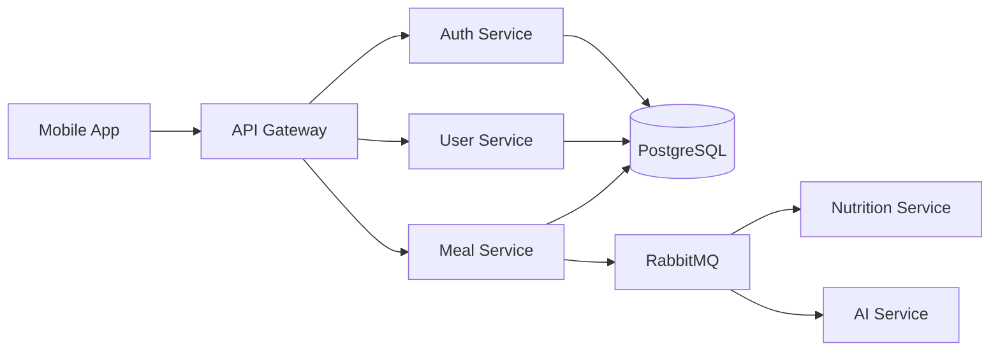
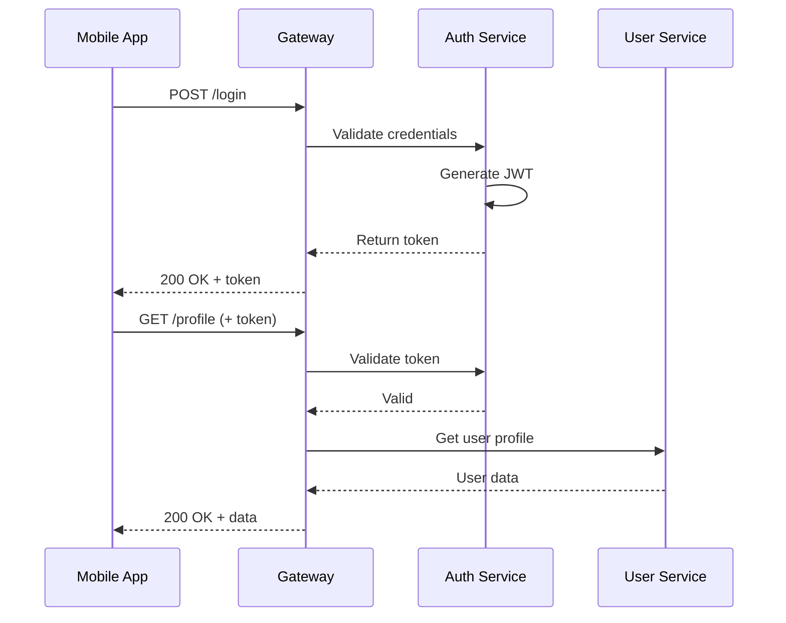
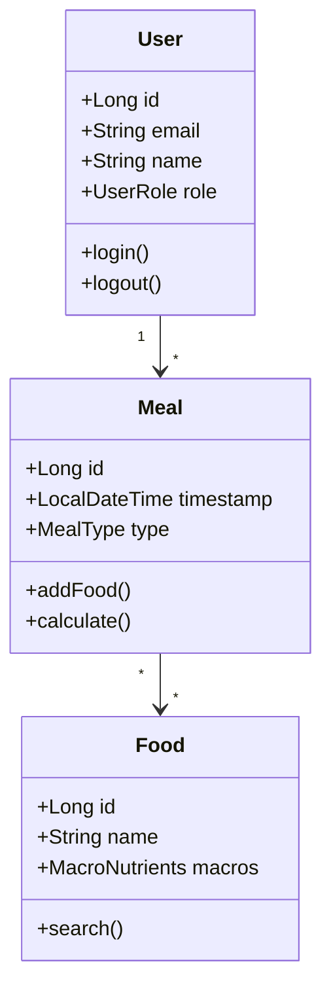

# 🎨 Guia de Design da Documentação

Este guia mostra todos os recursos visuais disponíveis na documentação do TrAIner Hub.

---

## ✨ Novos Recursos

### 🔍 Busca Melhorada
- Busca em tempo real com profundidade de 6 níveis
- Placeholder customizado
- Mensagens em português

### 📊 Estatísticas de Leitura
Cada página mostra tempo estimado de leitura e contagem de palavras.

### 📝 Editar no GitHub
Todas as páginas têm link direto para edição no GitHub.

### 🎨 Tema Responsivo com Dark Mode
A documentação adapta automaticamente ao tema do sistema (claro/escuro).

---

## 🎯 Componentes Visuais

### Alertas Personalizados

Use estas sintaxes especiais para criar alertas:

> [!NOTE]
> Este é um alerta informativo. Use para informações importantes mas neutras.

> [!TIP]
> Este é um alerta de dica/sucesso. Use para boas práticas e sugestões.

> [!WARNING]
> Este é um alerta de aviso. Use para avisos e cuidados necessários.

> [!DANGER]
> Este é um alerta de perigo. Use para avisos críticos e ações perigosas.

---

## 💎 Badges e Labels

Use badges para indicar status:

<span class="badge badge-dev">EM DESENVOLVIMENTO</span>
<span class="badge badge-new">NOVO</span>
<span class="badge badge-pending">PENDENTE</span>

Código:
```html
<span class="badge badge-dev">EM DESENVOLVIMENTO</span>
<span class="badge badge-new">NOVO</span>
<span class="badge badge-pending">PENDENTE</span>
```

---

## 📊 Tabelas Estilizadas

As tabelas têm design moderno automaticamente:

| Serviço | Status | Porta | Stack |
|---------|--------|-------|-------|
| Auth Service | 🚧 Em Dev | 8081 | Kotlin |
| User Service | 📝 Pendente | 8082 | Kotlin |
| Gateway | 🔜 Próximo | 8080 | Spring Cloud |

---

## 📝 Blocos de Código

### Syntax Highlighting

Suporte para múltiplas linguagens:

#### Kotlin
```kotlin
@RestController
@RequestMapping("/api/v1/users")
class UserController(private val userService: UserService) {
    
    @GetMapping("/{id}")
    fun getUser(@PathVariable id: Long): ResponseEntity<UserDTO> {
        return ResponseEntity.ok(userService.findById(id))
    }
}
```

#### TypeScript
```typescript
interface User {
  id: number;
  name: string;
  email: string;
}

const fetchUser = async (id: number): Promise<User> => {
  const response = await fetch(`/api/v1/users/${id}`);
  return response.json();
};
```

#### Python
```python
from fastapi import FastAPI, HTTPException
from pydantic import BaseModel

app = FastAPI()

class User(BaseModel):
    id: int
    name: str
    email: str

@app.get("/users/{user_id}")
async def get_user(user_id: int) -> User:
    return await user_service.find_by_id(user_id)
```

#### Bash
```bash
# Clone all repositories
git clone https://github.com/MateusO97/trainer-hub-docs.git
cd trainer-hub-docs

# Install dependencies
npm install

# Start local server
docsify serve .
```

---

## 📐 Diagramas Mermaid

### Diagrama de Fluxo



### Diagrama de Sequência



### Diagrama de Classes



---

## 🎨 Tipografia

A documentação usa fontes system-native para performance:

# Heading 1 - Título Principal
## Heading 2 - Seções Principais
### Heading 3 - Subseções
#### Heading 4 - Detalhes

**Texto em negrito** para ênfase forte.

*Texto em itálico* para ênfase leve.

`Código inline` para comandos e código.

---

## 🔗 Links

Links têm hover effect sutil:

- [Documentação Oficial](https://github.com/MateusO97/trainer-hub-docs)
- [GitHub Issues](https://github.com/MateusO97/trainer-hub-docs/issues)
- [Contribuir](https://github.com/MateusO97/trainer-hub-docs/pulls)

---

## 📋 Listas

### Lista com ícones

- ✅ Tarefa completada
- 🚧 Em desenvolvimento
- 📝 Planejado
- ❌ Cancelado
- 🔄 Em revisão

### Lista numerada

1. Primeiro passo
2. Segundo passo
3. Terceiro passo

### Lista aninhada

- Backend Services
  - Auth Service (Kotlin)
  - User Service (Kotlin)
  - Gateway (Spring Cloud)
- Frontend
  - Mobile App (React Native)
  - Admin Dashboard (Next.js)

---

## 🖼️ Imagens

Imagens têm zoom ao clicar:


---

## 📊 Citações

Use blockquotes para destacar informações importantes:

> **💡 Dica Profissional**  
> Use autenticação JWT com refresh tokens para melhor experiência do usuário.

> **⚠️ Atenção**  
> Sempre valide tokens no API Gateway antes de rotear requisições.

---

## 🎯 Tabs (Abas)

<!-- tabs:start -->

#### **Kotlin**

```kotlin
data class User(
    val id: Long,
    val name: String,
    val email: String
)
```

#### **TypeScript**

```typescript
interface User {
  id: number;
  name: string;
  email: string;
}
```

#### **Python**

```python
class User:
    def __init__(self, id: int, name: str, email: str):
        self.id = id
        self.name = name
        self.email = email
```

<!-- tabs:end -->

---

## 🎨 Design System

### Cores Principais

- **Primary**: `#6366f1` (Indigo 500)
- **Primary Dark**: `#4f46e5` (Indigo 600)
- **Success**: `#10b981` (Green 500)
- **Warning**: `#f59e0b` (Amber 500)
- **Danger**: `#ef4444` (Red 500)
- **Info**: `#3b82f6` (Blue 500)

### Espaçamentos

- **xs**: 0.25rem (4px)
- **sm**: 0.5rem (8px)
- **md**: 1rem (16px)
- **lg**: 1.5rem (24px)
- **xl**: 2rem (32px)

### Border Radius

- **sm**: 0.375rem (6px)
- **md**: 0.5rem (8px)
- **lg**: 0.75rem (12px)

---

## 📱 Responsividade

A documentação é totalmente responsiva:

- **Desktop**: Layout com sidebar fixa
- **Tablet**: Sidebar colapsável
- **Mobile**: Hamburger menu

---

## ⚡ Performance

### Otimizações

- ✅ Lazy loading de imagens
- ✅ Code splitting automático
- ✅ Cache de busca (24h)
- ✅ Minificação de assets
- ✅ CDN para bibliotecas

### Métricas Alvo

- **First Contentful Paint**: < 1.5s
- **Time to Interactive**: < 3s
- **Lighthouse Score**: > 90

---

## 🚀 Como Usar

### Adicionar Nova Página

1. Crie um arquivo `.md` em `docs/`
2. Adicione link em `_sidebar.md`
3. Commit e push
4. Deploy automático via GitHub Actions

### Sintaxe Especial

```markdown
> [!NOTE] Para alertas informativos

> [!TIP] Para dicas e sugestões

> [!WARNING] Para avisos

> [!DANGER] Para alertas críticos

<span class="badge badge-new">Novo</span> Para badges
```

---

## 📚 Referências

- [Docsify](https://docsify.js.org/)
- [Material Design](https://material.io/)
- [Tailwind CSS](https://tailwindcss.com/)
- [Docusaurus](https://docusaurus.io/)

---

**Última atualização**: Março 2026
