# TrAIner Hub - Arquitetura de Microsserviços

**Data**: Março 2026  
**Versão**: 1.0  
**Status**: Aprovado para Fase 1  

---

## 1. Visão Geral da Arquitetura

TrAIner Hub é uma **arquitetura de microsserviços distribuída** baseada em padrões de:
- **REST síncrono** para operações críticas (user, auth, meal-plan)
- **Event-driven assíncrono** para notificações e atualizações (RabbitMQ)
- **Database per service** (PostgreSQL + MongoDB)
- **API Gateway** como ponto de entrada único

```mermaid
graph TB
    subgraph "Client Layer"
        Mobile["📱 Mobile<br/>(React Native)"]
        Web["🌐 Web<br/>(React)"]
    end
    
    subgraph "API & Security"
        Gateway["🚪 Gateway Service<br/>(Rate Limit, Auth)"]
    end
    
    subgraph "Core Services"
        Auth["🔐 Auth Service<br/>(OAuth2, JWT)"]
        User["👤 User Service<br/>(Profiles, Prefs)"]
        MealPlan["📋 Meal Plan Service<br/>(Plans, Recipes)"]
        Meal["🍽️ Meal Service<br/>(Consumed, History)"]
    end
    
    subgraph "Nutrition & AI"
        Food["🍎 Food Service<br/>(CRUD, Search)"]
        Nutrition["📊 Nutrition Service<br/>(Macros, Analysis)"]
        AI["🤖 AI Service<br/>(Suggestions, Validation)"]
    end
    
    subgraph "Monitoring & Notifications"
        Tracking["📈 Tracking Service<br/>(Dashboard, Reports)"]
        Notification["🔔 Notification Service<br/>(Push, Email)"]
    end
    
    subgraph "Data Layer"
        PostgreSQL["🗄️ PostgreSQL<br/>(Transactional)"]
        MongoDB["📚 MongoDB<br/>(Logs, Analytics)"]
        Redis["⚡ Redis<br/>(Cache)"]
        RabbitMQ["🐰 RabbitMQ<br/>(Events)"]
    end
    
    subgraph "External APIs"
        Nutritionix["🔗 Nutritionix API"]
        OpenAI["🔗 OpenAI GPT-4o"]
        USDA["🔗 USDA API"]
    end
    
    Mobile --> Gateway
    Web --> Gateway
    
    Gateway --> Auth
    Gateway --> User
    Gateway --> MealPlan
    Gateway --> Meal
    Gateway --> Food
    Gateway --> Nutrition
    Gateway --> Tracking
    
    Auth -.-> PostgreSQL
    User -.-> PostgreSQL
    MealPlan -.-> PostgreSQL
    Meal -.-> PostgreSQL
    Food -.-> PostgreSQL
    Nutrition -.-> PostgreSQL
    
    Food -.-> Redis
    Nutrition -.-> Redis
    
    RabbitMQ -.-> Notification
    RabbitMQ -.-> Tracking
    RabbitMQ -.-> Nutrition
    
    AI --> Food
    AI --> Nutrition
    AI --> OpenAI
    
    Food --> Nutritionix
    Food --> USDA
    
    Notification -.-> MongoDB
    Tracking -.-> MongoDB
    
    style Gateway fill:#FF6B6B
    style Auth fill:#4ECDC4
    style PostgreSQL fill:#45B7D1
    style RabbitMQ fill:#F7B731
    style AI fill:#FF9FF3
```



---

## 2. Justificativa da Arquitetura de Microsserviços

### Por Que Microsserviços?

| Critério | Monolítico | Microsserviços | TrAIner Hub |
|----------|-----------|----------------|-----------|
| **Escalabilidade** | Tudo ou nada | Por serviço | ✅ food + nutrition precisam escalar |
| **Independência de Deploy** | Não | Sim | ✅ RF-002 (food pipeline) muda frequente |
| **Tech Stack Heterogêneo** | Não | Sim | ✅ Futura: Python para IA, Go para gateway |
| **Team Autonomy** | Baixa | Alta | ✅ Equipes podem trabalhar em paralelo |
| **Failure Isolation** | Não (cascata) | Sim | ✅ Se AI falha, meal logging continua |
| **Learning Curve Inicial** | Baixa | Alta | ⚠️ Trade-off aceito para flexibilidade |

**Decisão**: Microsserviços é **obrigatório** para:
1. Escalarem food-service independentemente (integração APIs externas é lenta)
2. Iterarem rápido no ai-service (sugestões mudam frequente)
3. Isolarem falhas (notification down ≠ meal logging quebrado)

---

## 3. Microsserviços Identificados (10 Serviços)

### Core Services (Críticos)

#### 3.1 **auth-service** 🔐
**Responsabilidade**: Autenticação, autorização, gerenciamento de sessões

**Endpoints**:
- `POST /auth/login` - Login com email/password
- `POST /auth/signup` - Registrar novo usuário
- `POST /auth/refresh` - Renovar token JWT
- `POST /auth/logout` - Logout e invalidar token
- `GET /auth/me` - Obter usuário autenticado

**Database Ownership**:
- `users` table (email, password_hash, created_at)
- `user_sessions` table (token, expiry, user_id)

**Dependências**:
- Nenhuma (serviço raiz)

**Eventos**:
- Produz: `user.created`, `user.deleted`
- Consome: nenhum

**Tratamento de Falhas**:
- Token inválido → 401 Unauthorized
- Login incorreto → 401 + rate limiting (3 tentativas/10min)
- Session expirada → refresh token automático

---

#### 3.2 **user-service** 👤
**Responsabilidade**: Perfis de usuário, preferências, configurações

**Endpoints**:
- `GET /users/{id}` - Obter perfil do usuário
- `PUT /users/{id}` - Atualizar perfil
- `GET /users/{id}/preferences` - Obter preferências (alergias, restrições)
- `PUT /users/{id}/preferences` - Atualizar preferências
- `POST /users/{id}/favorite-foods` - Adicionar alimento favorito

**Database Ownership**:
- `user_profiles` table (name, age, weight, height, goal)
- `user_preferences` table (allergies, dietary_restrictions, target_calories)
- `favorite_foods` table (user_id, food_id)

**Dependências**:
- auth-service (validar token)

**Eventos**:
- Produz: `user.updated`, `preferences.changed`
- Consome: nenhum

**Integração com Outros Serviços**:
- meal-plan-service chama para validar targets do usuário
- nutrition-service chama para calcular targets baseado em peso/altura

**Tratamento de Falhas**:
- Perfil não encontrado → 404
- Atualização conflitante → 409 + retry automático

---

#### 3.3 **meal-plan-service** 📋
**Responsabilidade**: Criação e gerenciamento de planos alimentares

**Endpoints**:
- `POST /meal-plans` - Criar novo plano
- `GET /meal-plans/{id}` - Obter plano
- `PUT /meal-plans/{id}` - Atualizar plano
- `GET /meal-plans/{id}/meals` - Listar refeições do plano
- `POST /meal-plans/{id}/meals` - Adicionar refeição ao plano
- `DELETE /meal-plans/{id}/meals/{meal_id}` - Remover refeição

**Database Ownership**:
- `meal_plans` table (user_id, name, start_date, end_date, targets)
- `meals_in_plan` table (meal_plan_id, meal_type, meal_date, foods)

**Dependências**:
- user-service (validar targets do usuário)
- nutrition-service (calcular macros do plano)
- food-service (validar alimentos)

**Eventos**:
- Produz: `meal_plan.created`, `meal_plan.updated`
- Consome: `food.updated` (recalcular macros do plano)

**Tratamento de Falhas**:
- Nutrição-service timeout → salvar com macros [pending recalc]
- Alimento não encontrado → sugestão de buscar via IA

---

#### 3.4 **meal-service** 🍽️
**Responsabilidade**: Registro de refeições consumidas, histórico

**Endpoints**:
- `POST /meals` - Registrar nova refeição
- `GET /meals/{id}` - Obter detalhes da refeição
- `PUT /meals/{id}` - Editar refeição
- `DELETE /meals/{id}` - Deletar refeição
- `GET /meals?date=2026-03-08` - Listar refeições da data

**Database Ownership**:
- `meals_consumed` table (user_id, meal_date, meal_type, total_calories, created_at)
- `meal_foods` table (meal_id, food_id, quantity_grams, macros_recorded)

**Dependências**:
- food-service (buscar/criar alimentos)
- nutrition-service (calcular macros totais)
- meal-plan-service (comparar com plano)

**Eventos**:
- Produz: `meal.created`, `meal.updated`, `meal.deleted`
- Consome: nenhum

**Integração**:
- Publica evento `meal.created` → tracking + notification escutam

**Tratamento de Falhas**:
- Alimento não encontrado → criar com macros [pending validation]
- Food-service offline → usar cache Redis ou macros manuais

---

### Nutrition & AI Services

#### 3.5 **food-service** 🍎
**Responsabilidade**: CRUD de alimentos, busca, integração APIs externas

**Endpoints**:
- `GET /foods/search?query=frango` - Buscar alimentos
- `POST /foods` - Criar alimento manualmente
- `GET /foods/{id}` - Obter detalhes completos
- `PUT /foods/{id}` - Atualizar macros (admin)
- `GET /foods/{id}/alternatives` - Alimentos similares

**Database Ownership**:
- `foods` table (name, source, created_at)
- `food_macros` table (food_id, serving_size, calories, protein, carbs, fat)

**External APIs**:
- Nutritionix API (GET search, fallback)
- USDA API (macros backup)

**Eventos**:
- Produz: `food.created`, `food.updated`, `food.validation_failed`
- Consome: `nutrition.macro_reference_updated`

**Cache Strategy**:
- Redis: `food:{name}:{quantity}:macros` (TTL 7 dias)
- PostgreSQL: fonte de verdade

**Tratamento de Falhas**:
- Nutritionix timeout (2s) → fallback USDA
- USDA timeout → ask OpenAI para estimativa
- Tudo falha → salvar com macros [pending validation]
- Circuit breaker: Nutritionix down → 10s cooldown antes de retry

---

#### 3.6 **nutrition-service** 📊
**Responsabilidade**: Cálculos de macros, análises nutricionais, algoritmos

**Endpoints**:
- `POST /nutrition/calculate` - Calcular macros de uma refeição
- `GET /nutrition/daily-summary?date=2026-03-08` - Resumo diário
- `GET /nutrition/comparison?meal_id=X&plan_id=Y` - Comparar meal vs. plan
- `POST /nutrition/suggestions?user_id=X` - Sugestões de ajustes
- `GET /nutrition/analytics?user_id=X&period=week` - Análise semanal

**Database Ownership**:
- `nutrition_targets` table (user_id, date, target_calories, actual_consumed)
- `daily_macros_cache` table (user_id, date, macros, calculated_at)

**Dependências**:
- food-service (macros de alimentos)
- meal-service (refeições do dia)
- user-service (targets do usuário)

**Eventos**:
- Produz: `nutrition.macro_changed`, `nutrition.target_exceeded`
- Consome: `meal.created` (recalcular diários)

**Algoritmos Críticos**:
1. **Cálculo de Macros**: somar alimentos × quantidade
2. **% Atingida**: consumed / target × 100%
3. **Sugestões de Ajustes**: regras heurísticas (RFC-003)

**Caching**:
- Redis: `nutrition:{user_id}:{date}:summary` (TTL 2h, invalidado on meal change)
- PostgreSQL: histórico persistente

---

#### 3.7 **ai-service** 🤖
**Responsabilidade**: Orquestração de IA, sugestões, validação, otimização

**Endpoints**:
- `POST /ai/find-food?query=frango&quantity=100` - Buscar alimento com IA
- `POST /ai/suggest-alternatives?meal_id=X` - Sugestões de troca
- `POST /ai/meal-recommendations?user_id=X` - Recomendações personalizadas
- `POST /ai/validate-macros` - Validar se macros são realísticas

**External APIs**:
- OpenAI (GPT-4o): sugestões, validação, análise
- food-service (busca local)
- nutrition-service (validação)

**Events**:
- Produz: `ai.suggestion_generated`, `ai.validation_failed`
- Consome: nenhum

**Implementação**:
- **RFC-002**: Pipeline detalhado de busca (fallback: local → Nutritionix → OpenAI)
- Cost management: batch requests, caching de respostas, quotas

**Tratamento de Falhas**:
- OpenAI timeout (5s) → retornar erro suave ("tente novamente")
- Macros inconsistentes → flag [needs_review] + alert admin

**Cache**:
- Redis: `ai:{prompt_hash}:response` (TTL 30 dias)

---

### Monitoring & Notifications

#### 3.8 **tracking-service** 📈
**Responsabilidade**: Monitoramento, dashboards, relatórios

**Endpoints**:
- `GET /tracking/dashboard?user_id=X&date=2026-03-08` - Dashboard diário
- `GET /tracking/history?user_id=X&period=week` - Histórico semanal
- `GET /tracking/compare?user_id=X&plan_id=Y&period=week` - Comparação plan vs. real
- `GET /tracking/insights?user_id=X` - Insights automáticos

**Database Ownership**:
- Não tem tabelas proprietárias
- Queries em PostgreSQL (denormalized views)
- Analytics em MongoDB

**Dependências**:
- nutrition-service (dados de macros)
- meal-service (refeições)
- meal-plan-service (plano planejado)

**Eventos**:
- Produz: `tracking.goal_achieved`, `tracking.warning_generated`
- Consome: `meal.created`, `nutrition.macro_changed`

**Insights Automáticos**:
- "Seu consumo de proteína está 80% acima do target essa semana"
- "Parabéns! Aderência de 95% no plano. Continue assim!"
- "Coloque +50g carboidrato amanhã para atingir target"

**Cache**:
- Redis: dashboards pré-calculados (TTL 1h)
- MongoDB: analytics para deep dives

---

#### 3.9 **notification-service** 🔔
**Responsabilidade**: Notificações, lembretes, alertas

**Endpoints**:
- `POST /notifications/preferences` - Configurar preferências de notificação
- `GET /notifications` - Listar notificações do usuário
- `PUT /notifications/{id}/read` - Marcar como lido

**Channels**:
- Push notifications (mobile)
- Email (diários/semanais)
- In-app alerts

**Events**:
- Consome: `meal.created`, `tracking.goal_achieved`, `tracking.warning_generated`
- Produz: `notification.sent`

**Tratamento de Falhas**:
- Push service offline → queue em RabbitMQ, retry exponencial
- Email bounce → mark invalid, remove do broadcasting

**Rate Limiting**:
- Max 5 notificações/dia por usuário (exceto alertas críticos)
- Quiet hours: 23h-07h (sem notificações)

---

### API & Gateway

#### 3.10 **gateway-service** 🚪
**Responsabilidade**: API Gateway, roteamento, rate limiting, autenticação

**Features**:
- **Roteamento**: `/api/users/X` → user-service:8081
- **Rate Limiting**: 100 req/min por user, 10k req/min por IP
- **Authentication**: Validar JWT token em todos requests
- **Request/Response Logging**: Audit trail completo
- **Versioning**: `/api/v1/` prefix para future-proofing
- **CORS**: Whitelist de origins (mobile.trainerhubamd.com, web.trainerhubamd.com)

**Middleware Stack**:
1. Rate Limiter
2. CORS Handler
3. Request Logger
4. JWT Validator
5. Request Router
6. Response Formatter

**Health Checks**:
- `/health` - Status do gateway
- `/health/services` - Status de todos os serviços

**Timeout Defaults**:
- Normal requests: 30s
- Long-running (IA): 60s
- Fallback to error after timeout

---

## 4. Padrões de Comunicação

### 4.1 REST Síncrono (Request-Response)

**Quando usar**: Operações críticas que precisam de resultado imediato

| Serviço Call | Latência Esperada | Caso de Uso |
|---|---|---|
| gateway → auth | < 50ms | Validar token |
| meal → food | < 100ms | Buscar alimento |
| meal → nutrition | < 200ms | Calcular macros |
| ai → openai | 1-5s | Sugestão IA |

**Exemplo**: Registrar refeição
```
POST /api/v1/meals
├─ Meal Service recebe
├─ Chama Food Service (buscar/validar alimentos) - 100ms
├─ Chama Nutrition Service (calcular macros) - 200ms
├─ Salva em PostgreSQL - 50ms
└─ Retorna response em ~400ms
```

### 4.2 Event-Driven Assíncrono (Pub-Sub)

**Quando usar**: Operações que podem ser processadas depois (notificações, analytics)

| Evento | Producer | Consumers |
|---|---|---|
| `meal.created` | meal-service | tracking-service, notification-service |
| `nutrition.macro_changed` | nutrition-service | tracking-service, ai-service |
| `tracking.goal_achieved` | tracking-service | notification-service |
| `food.updated` | food-service | nutrition-service, ai-service |

**Exemplo**: Registrar refeição com eventos
```
Meal Service publica "meal.created" evento
├─ Tracking Service (async) - atualiza dashboard
├─ Notification Service (async) - envia alert se meta atingida
└─ AI Service (async) - gera sugestões para próxima refeição
```

**Broker**: RabbitMQ (MVP) com upgrade path a Kafka

---

## 5. Deployment Model

### Local Development
```
Docker Compose:
├── postgres:15
├── mongodb:6
├── redis:7
├── rabbitmq:3.12
├── auth-service:8081
├── user-service:8082
├── meal-plan-service:8083
├── meal-service:8084
├── food-service:8085
├── nutrition-service:8086
├── tracking-service:8087
├── notification-service:8088
├── ai-service:8089
└── gateway-service:8080
```

### Production (Fase 4)
```
Kubernetes:
├── Namespace: trainer-hub
├── Services (each microservice)
│   ├── Deployment: 3 replicas min
│   ├── HPA: autoscale 3-10 replicas
│   └── Service: ClusterIP internal, Ingress external
├── Databases
│   ├── PostgreSQL StatefulSet (HA + backups)
│   ├── MongoDB StatefulSet (replica set)
│   └── Redis StatefulSet (master-slave)
├── Message Broker
│   └── RabbitMQ Operator (HA)
└── Ingress Controller
    ├── TLS/SSL termination
    ├── Rate limiting
    └── API versioning
```

---

## 6. Trade-offs e Decisões

### ✅ Decisões Confirmadas

| Decisão | Vantagem | Desvantagem | Situação |
|---------|----------|-----------|---------|
| **Microsserviços** | Escalabilidade, independência | Complexidade, latência | ✅ Benefício > risco |
| **REST + Events** | Simples, robusto | Eventual consistency | ✅ Aceitável para MVP |
| **PostgreSQL principal** | ACID, relacionamentos | Múltiplos schemas | ✅ Necessário |
| **RabbitMQ (MVP)** | Simples, operacional | Throughput limitado | ✅ Upgrade path claro |
| **JWT tokens** | Stateless, escalável | Token revocation complexo | ✅ Bom para mobile |

### ⚠️ Futuros Upgrades (Fase 4+)

1. **Kafka em lugar de RabbitMQ** - Se throughput crescer > 10k eventos/min
2. **GraphQL gateway** - Se frontend precisa queries flexíveis
3. **Service mesh (Istio)** - Se observabilidade crítica
4. **CQRS + Event Sourcing** - Se auditoria completa necessária

---

## 7. Diagrama de Dependências

```
auth-service
    ↓
gateway-service, user-service, meal-plan-service, meal-service
    ↓
food-service ←→ nutrition-service
    ↓
ai-service
    ↓
tracking-service, notification-service
```

**Critical Path**: auth → user → meal-plan → meal → nutrition → tracking

**Parallelizável**: food-service e nutrition-service podem rodar em paralelo

---

## 8. Conclusão

A arquitetura de **10 microsserviços** é a escolha certa para TrAIner Hub porque:

1. ✅ Permite escalar food + nutrition independentemente
2. ✅ Isola falhas (AI down ≠ meal logging quebrado)
3. ✅ Suporta teams autônomos
4. ✅ Flexível para futuras integrações (wearables, APIs)
5. ✅ Event-driven garante notificações em tempo real

**Próximos passos**:
- Fase 1.3: Tech Stack (linguagens, frameworks)
- Fase 1.4: Database Design (schemas detalhados)
- Fase 3: Implementar serviços em ordem: auth → user → food → ... → gateway

---

**Referências**:
- [RFC-001: Sincronização de Macros](../rfc/RFC-001-MACRO-SYNC.md)
- [RFC-002: Pipeline de IA para Alimentos](../rfc/RFC-002-AI-FOOD-PIPELINE.md)
- [Próximo: Tech Stack (03-TECH-STACK.md)](03-TECH-STACK.md)
