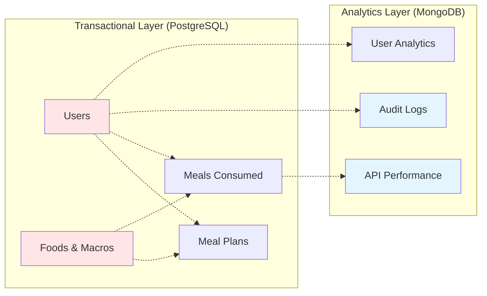
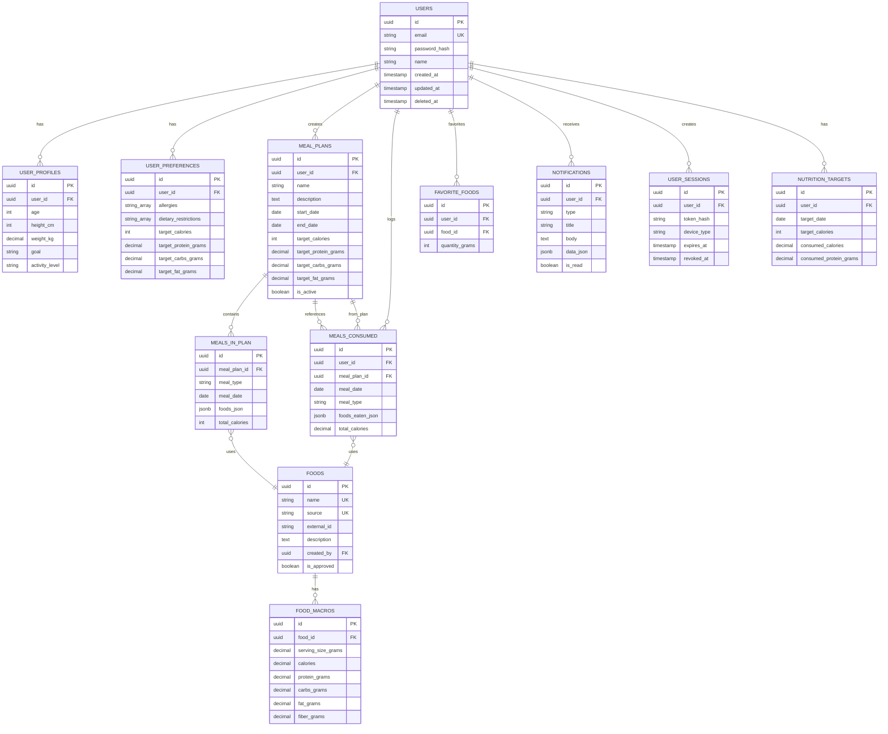

# TrAIner Hub - Design de Banco de Dados

**Data**: Março 2026  
**Versão**: 1.0  
**Status**: Aprovado para Fase 1  

---

## 1. Visão Geral do Design de Dados

TrAIner Hub utiliza **duas fontes de dados**:

1. **PostgreSQL** - Transactional, ACID, relacionamentos
2. **MongoDB** - Analytics, logs, append-only



---

## 2. PostgreSQL Schema Detalhado

### 2.1 Tabela: `users`

```sql
CREATE TABLE users (
    id UUID PRIMARY KEY DEFAULT uuid_generate_v4(),
    email VARCHAR(255) NOT NULL UNIQUE,
    password_hash VARCHAR(255) NOT NULL,
    name VARCHAR(255) NOT NULL,
    created_at TIMESTAMP DEFAULT CURRENT_TIMESTAMP,
    updated_at TIMESTAMP DEFAULT CURRENT_TIMESTAMP,
    deleted_at TIMESTAMP NULL,
    
    CONSTRAINT email_format CHECK (email ~* '^[A-Za-z0-9._%+-]+@[A-Za-z0-9.-]+\.[A-Z|a-z]{2,}$')
);

CREATE INDEX idx_users_email ON users(email);
CREATE INDEX idx_users_created_at ON users(created_at);
```

**Propósito**: Armazenar usuários da plataforma
**Ownership**: auth-service (create, delete) / user-service (read)
**Retention**: Indefinido (soft delete via deleted_at)

---

### 2.2 Tabela: `user_profiles`

```sql
CREATE TABLE user_profiles (
    id UUID PRIMARY KEY DEFAULT uuid_generate_v4(),
    user_id UUID NOT NULL UNIQUE REFERENCES users(id) ON DELETE CASCADE,
    age INTEGER,
    height_cm INTEGER,
    weight_kg DECIMAL(5, 2),
    goal VARCHAR(50), -- 'muscle_gain', 'fat_loss', 'maintenance'
    activity_level VARCHAR(50), -- 'sedentary', 'light', 'moderate', 'intense'
    created_at TIMESTAMP DEFAULT CURRENT_TIMESTAMP,
    updated_at TIMESTAMP DEFAULT CURRENT_TIMESTAMP
);

CREATE INDEX idx_user_profiles_user_id ON user_profiles(user_id);
```

**Propósito**: Perfil do usuário (biometria, objetivo)
**Ownership**: user-service
**Relação**: 1:1 com users

---

### 2.3 Tabela: `user_preferences`

```sql
CREATE TABLE user_preferences (
    id UUID PRIMARY KEY DEFAULT uuid_generate_v4(),
    user_id UUID NOT NULL UNIQUE REFERENCES users(id) ON DELETE CASCADE,
    allergies TEXT[] DEFAULT '{}', -- ['peanuts', 'dairy', ...]
    dietary_restrictions TEXT[] DEFAULT '{}', -- ['vegetarian', 'vegan', ...]
    target_calories INTEGER,
    target_protein_grams DECIMAL(6, 2),
    target_carbs_grams DECIMAL(6, 2),
    target_fat_grams DECIMAL(6, 2),
    created_at TIMESTAMP DEFAULT CURRENT_TIMESTAMP,
    updated_at TIMESTAMP DEFAULT CURRENT_TIMESTAMP
);

CREATE INDEX idx_user_preferences_user_id ON user_preferences(user_id);
```

**Propósito**: Preferências e restrições do usuário
**Ownership**: user-service
**Relação**: 1:1 com users

---

### 2.4 Tabela: `meal_plans`

```sql
CREATE TABLE meal_plans (
    id UUID PRIMARY KEY DEFAULT uuid_generate_v4(),
    user_id UUID NOT NULL REFERENCES users(id) ON DELETE CASCADE,
    name VARCHAR(255) NOT NULL,
    description TEXT,
    start_date DATE NOT NULL,
    end_date DATE NOT NULL,
    target_calories INTEGER NOT NULL,
    target_protein_grams DECIMAL(6, 2) NOT NULL,
    target_carbs_grams DECIMAL(6, 2) NOT NULL,
    target_fat_grams DECIMAL(6, 2) NOT NULL,
    is_active BOOLEAN DEFAULT TRUE,
    created_at TIMESTAMP DEFAULT CURRENT_TIMESTAMP,
    updated_at TIMESTAMP DEFAULT CURRENT_TIMESTAMP,
    
    CONSTRAINT valid_dates CHECK (end_date >= start_date)
);

CREATE INDEX idx_meal_plans_user_id ON meal_plans(user_id);
CREATE INDEX idx_meal_plans_active ON meal_plans(user_id, is_active);
```

**Propósito**: Planos alimentares do usuário
**Ownership**: meal-plan-service
**Relação**: N:1 com users

---

### 2.5 Tabela: `meals_in_plan`

```sql
CREATE TABLE meals_in_plan (
    id UUID PRIMARY KEY DEFAULT uuid_generate_v4(),
    meal_plan_id UUID NOT NULL REFERENCES meal_plans(id) ON DELETE CASCADE,
    meal_type VARCHAR(50) NOT NULL, -- 'breakfast', 'lunch', 'snack', 'dinner'
    meal_date DATE NOT NULL,
    foods_json JSONB NOT NULL DEFAULT '[]', -- [{food_id: uuid, quantity_grams: int}, ...]
    total_calories INTEGER,
    total_protein_grams DECIMAL(6, 2),
    total_carbs_grams DECIMAL(6, 2),
    total_fat_grams DECIMAL(6, 2),
    created_at TIMESTAMP DEFAULT CURRENT_TIMESTAMP,
    updated_at TIMESTAMP DEFAULT CURRENT_TIMESTAMP
);

CREATE INDEX idx_meals_in_plan_plan_id ON meals_in_plan(meal_plan_id);
CREATE INDEX idx_meals_in_plan_date ON meals_in_plan(meal_plan_id, meal_date);
```

**Propósito**: Refeições planejadas dentro de um plano
**Ownership**: meal-plan-service
**Relação**: N:1 com meal_plans

---

### 2.6 Tabela: `foods`

```sql
CREATE TABLE foods (
    id UUID PRIMARY KEY DEFAULT uuid_generate_v4(),
    name VARCHAR(255) NOT NULL,
    source VARCHAR(50) NOT NULL, -- 'internal', 'nutritionix', 'usda', 'ai_generated'
    external_id VARCHAR(255), -- ID externo (ex: Nutritionix food_name)
    description TEXT,
    created_by UUID REFERENCES users(id) ON DELETE SET NULL, -- null = admin
    is_approved BOOLEAN DEFAULT FALSE, -- AI/admin validation
    created_at TIMESTAMP DEFAULT CURRENT_TIMESTAMP,
    updated_at TIMESTAMP DEFAULT CURRENT_TIMESTAMP,
    
    CONSTRAINT unique_food_per_source UNIQUE(name, source)
);

CREATE INDEX idx_foods_name ON foods USING GIN(to_tsvector('english', name));
CREATE INDEX idx_foods_source ON foods(source);
CREATE INDEX idx_foods_created_at ON foods(created_at);
```

**Propósito**: Base de alimentos da plataforma
**Ownership**: food-service
**Relação**: 1:N com food_macros

**Note**: Índice GIN permite full-text search eficiente

---

### 2.7 Tabela: `food_macros`

```sql
CREATE TABLE food_macros (
    id UUID PRIMARY KEY DEFAULT uuid_generate_v4(),
    food_id UUID NOT NULL REFERENCES foods(id) ON DELETE CASCADE,
    serving_size_grams DECIMAL(8, 2) NOT NULL, -- Base de cálculo (ex: 100g frango)
    calories DECIMAL(8, 2) NOT NULL,
    protein_grams DECIMAL(8, 2),
    carbs_grams DECIMAL(8, 2),
    fat_grams DECIMAL(8, 2),
    fiber_grams DECIMAL(8, 2),
    sugar_grams DECIMAL(8, 2),
    sodium_mg DECIMAL(8, 2),
    validated_at TIMESTAMP, -- Quando foi validado
    validation_notes TEXT,
    created_at TIMESTAMP DEFAULT CURRENT_TIMESTAMP,
    updated_at TIMESTAMP DEFAULT CURRENT_TIMESTAMP
);

CREATE INDEX idx_food_macros_food_id ON food_macros(food_id);
```

**Propósito**: Macronutrientes de cada alimento
**Ownership**: food-service
**Relação**: N:1 com foods

---

### 2.8 Tabela: `meals_consumed`

```sql
CREATE TABLE meals_consumed (
    id UUID PRIMARY KEY DEFAULT uuid_generate_v4(),
    user_id UUID NOT NULL REFERENCES users(id) ON DELETE CASCADE,
    meal_plan_id UUID REFERENCES meal_plans(id) ON DELETE SET NULL, -- Opcional (pode vir de fora do plano)
    meal_date DATE NOT NULL,
    meal_type VARCHAR(50) NOT NULL, -- 'breakfast', 'lunch', 'snack', 'dinner'
    foods_eaten_json JSONB NOT NULL DEFAULT '[]', -- [{food_id: uuid, quantity_grams: int, macros_recorded: {...}}, ...]
    total_calories DECIMAL(8, 2),
    total_protein_grams DECIMAL(8, 2),
    total_carbs_grams DECIMAL(8, 2),
    total_fat_grams DECIMAL(8, 2),
    notes TEXT,
    created_at TIMESTAMP DEFAULT CURRENT_TIMESTAMP,
    updated_at TIMESTAMP DEFAULT CURRENT_TIMESTAMP,
    
    CONSTRAINT unique_meal_per_day UNIQUE(user_id, meal_date, meal_type)
);

CREATE INDEX idx_meals_consumed_user_date ON meals_consumed(user_id, meal_date);
CREATE INDEX idx_meals_consumed_meal_plan ON meals_consumed(meal_plan_id);
```

**Propósito**: Refeições consumidas pelos usuários (histórico real)
**Ownership**: meal-service
**Relação**: N:1 com users, M:1 com meal_plans

---

### 2.9 Tabela: `favorite_foods`

```sql
CREATE TABLE favorite_foods (
    id UUID PRIMARY KEY DEFAULT uuid_generate_v4(),
    user_id UUID NOT NULL REFERENCES users(id) ON DELETE CASCADE,
    food_id UUID NOT NULL REFERENCES foods(id) ON DELETE CASCADE,
    quantity_grams INTEGER, -- Quantidade padrão (ex: sempre 100g)
    added_at TIMESTAMP DEFAULT CURRENT_TIMESTAMP,
    
    CONSTRAINT unique_favorite UNIQUE(user_id, food_id)
);

CREATE INDEX idx_favorite_foods_user_id ON favorite_foods(user_id);
```

**Propósito**: Alimentos favoritos do usuário para acesso rápido
**Ownership**: user-service
**Relação**: N:N entre users e foods

---

### 2.10 Tabela: `nutrition_targets`

```sql
CREATE TABLE nutrition_targets (
    id UUID PRIMARY KEY DEFAULT uuid_generate_v4(),
    user_id UUID NOT NULL REFERENCES users(id) ON DELETE CASCADE,
    target_date DATE NOT NULL,
    target_calories INTEGER NOT NULL,
    consumed_calories DECIMAL(8, 2) DEFAULT 0,
    consumed_protein_grams DECIMAL(8, 2) DEFAULT 0,
    consumed_carbs_grams DECIMAL(8, 2) DEFAULT 0,
    consumed_fat_grams DECIMAL(8, 2) DEFAULT 0,
    percentage_complete DECIMAL(5, 2), -- % atingido
    status VARCHAR(50), -- 'in_progress', 'completed', 'exceed'
    updated_at TIMESTAMP DEFAULT CURRENT_TIMESTAMP,
    
    CONSTRAINT unique_daily_target UNIQUE(user_id, target_date)
);

CREATE INDEX idx_nutrition_targets_user_date ON nutrition_targets(user_id, target_date);
```

**Propósito**: Resumo diário de consumo vs. target (cached)
**Ownership**: nutrition-service
**Relação**: N:1 com users

---

### 2.11 Tabela: `notifications`

```sql
CREATE TABLE notifications (
    id UUID PRIMARY KEY DEFAULT uuid_generate_v4(),
    user_id UUID NOT NULL REFERENCES users(id) ON DELETE CASCADE,
    type VARCHAR(50) NOT NULL, -- 'reminder', 'alert', 'suggestion', 'achievement'
    title VARCHAR(255) NOT NULL,
    body TEXT NOT NULL,
    data_json JSONB DEFAULT '{}', -- Metadata (ex: meal_id, suggestion_data)
    is_read BOOLEAN DEFAULT FALSE,
    read_at TIMESTAMP,
    created_at TIMESTAMP DEFAULT CURRENT_TIMESTAMP,
    expires_at TIMESTAMP
);

CREATE INDEX idx_notifications_user_unread ON notifications(user_id, is_read);
CREATE INDEX idx_notifications_created_at ON notifications(user_id, created_at);
```

**Propósito**: Notificações para o usuário
**Ownership**: notification-service
**Relação**: N:1 com users

---

### 2.12 Tabela: `user_sessions`

```sql
CREATE TABLE user_sessions (
    id UUID PRIMARY KEY DEFAULT uuid_generate_v4(),
    user_id UUID NOT NULL REFERENCES users(id) ON DELETE CASCADE,
    token_hash VARCHAR(255) NOT NULL UNIQUE, -- Hash do JWT para invalidação
    device_type VARCHAR(50), -- 'mobile', 'web'
    user_agent VARCHAR(500),
    ip_address INET,
    expires_at TIMESTAMP NOT NULL,
    revoked_at TIMESTAMP, -- Logout = SET revoked_at
    created_at TIMESTAMP DEFAULT CURRENT_TIMESTAMP
);

CREATE INDEX idx_user_sessions_user_id ON user_sessions(user_id);
CREATE INDEX idx_user_sessions_token_hash ON user_sessions(token_hash);
```

**Propósito**: Gerenciar sessões de usuário (JWT blacklist)
**Ownership**: auth-service
**Relação**: N:1 com users

---

## 3. MongoDB Collections (Analytics & Logs)

### 3.1 Collection: `audit_logs`

```json
{
  "_id": ObjectId,
  "user_id": "uuid",
  "action": "CREATE_MEAL | UPDATE_PLAN | DELETE_FOOD",
  "resource_type": "meal | plan | food",
  "resource_id": "uuid",
  "old_value": { /* antes */ },
  "new_value": { /* depois */ },
  "ip_address": "192.168.1.1",
  "user_agent": "Mozilla/5.0...",
  "timestamp": ISODate("2026-03-08T10:30:00.000Z"),
  "ttl_days": 365
}
```

**Propósito**: Rastrear todas as ações dos usuários
**TTL**: 1 ano (auto-cleanup)
**Índices**: `user_id`, `timestamp`, `resource_type`

---

### 3.2 Collection: `api_performance`

```json
{
  "_id": ObjectId,
  "service": "meal-service",
  "endpoint": "/api/v1/meals",
  "method": "POST",
  "status_code": 201,
  "latency_ms": 245,
  "user_id": "uuid",
  "timestamp": ISODate("2026-03-08T10:30:00.000Z"),
  "error_message": null,
  "ttl_days": 30
}
```

**Propósito**: Monitorar latência e erros de APIs
**TTL**: 30 dias (performance analytics)
**Índices**: `service`, `timestamp`, `status_code`

---

### 3.3 Collection: `user_analytics`

```json
{
  "_id": ObjectId,
  "user_id": "uuid",
  "date": ISODate("2026-03-08"),
  "sessions_count": 3,
  "meals_logged": 5,
  "features_used": ["meal_logger", "meal_plan_view", "suggestions"],
  "last_active": ISODate("2026-03-08T18:45:00.000Z"),
  "retention_cohort": "2026-02-01", -- Data de signup
  "ttl_days": 365
}
```

**Propósito**: Analytics de engagement do usuário
**TTL**: 1 ano (histórico de engagement)
**Índices**: `user_id`, `date`, `retention_cohort`

---

## 4. Diagrama ER Completo



---

## 5. Estratégia de Sincronização Entre Serviços

### Problema
Food-service atualiza `foods` table (macros corrigidas), nutrition-service precisa saber.

### Solução: Event-Driven Sync (RFC-001)

```
food-service atualiza foods.macros
    ↓
food-service publica evento "food.macros_updated" → RabbitMQ
    ↓
nutrition-service subscreve evento
    ↓
nutrition-service atualiza cache Redis: nutrition:{user_id}:{date}:summary
    ↓
Próximas queries usam cache atualizado
```

**Característica**: Eventual consistency (100ms latência típica)

---

## 6. Índices e Performance

### Critical Indexes

| Tabela | Índice | Tipo | Razão |
|--------|--------|------|-------|
| meals_consumed | (user_id, meal_date) | BTREE | Principal query |
| foods | name | GIN (text search) | Busca de alimentos |
| macro_targets | (user_id, target_date) | BTREE | Busca diária |
| user_sessions | token_hash | HASH | Validação JWT |
| favorite_foods | user_id | BTREE | Carregamento rápido |

### Expected Query Performance

- `SELECT meals WHERE user_id=X AND date=Y` → < 10ms
- `SELECT foods WHERE name ~* 'frango'` → < 50ms
- `SELECT SUM(calories) FROM meals_consumed` → < 100ms

---

## 7. Backup e Disaster Recovery

### PostgreSQL Strategy

```sql
-- WAL Archiving (Point-in-time recovery)
wal_archiving_enabled = on
archive_command = 'aws s3 cp %p s3://trainer-hub-backups/wal/%f'
archive_timeout = 300

-- Full backups
pg_dump --format=custom --compress=9 trainer_hub > backup_$(date +%Y%m%d).dump

-- Schedule: Daily full + continuous WAL archiving
```

### MongoDB Strategy

```javascript
// Replica set (HA + automatic failover)
rs.initiate({
  _id: "trainer-hub-rs",
  members: [
    { _id: 0, host: "mongo-1:27017", priority: 10 },
    { _id: 1, host: "mongo-2:27017", priority: 5 },
    { _id: 2, host: "mongo-3:27017", priority: 5 }
  ]
})

// Backup
mongodump --archive=/backups/trainer-hub-$(date +%Y%m%d).archive
```

### RTO / RPO (Recovery targets)

- **RTO** (Recovery Time Objective): < 1 hora
- **RPO** (Recovery Point Objective): < 5 minutos
- **Test frequency**: Mensal (restore em staging)

---

## 8. Escalabilidade

### Partitioning (Se necessário Year 2+)

```sql
-- Partition meals_consumed by date (1 partition per month)
CREATE TABLE meals_consumed_2026_03 PARTITION OF meals_consumed
    FOR VALUES FROM ('2026-03-01') TO ('2026-04-01');
```

### Connection Pooling

```yaml
# PgBouncer (frontend pool)
max_client_conn = 10000
min_pool_size = 10
default_pool_size = 25
```

### Cache Warming

```redis
# Redis pipeline warm-up on startup
DEL nutrition:*
EVAL <script> 0  # Carrega dados cache quentes
```

---

## 9. Conclusão

O design de banco de dados TrAIner Hub é:

✅ **Normalizado** (PostgreSQL) para transações  
✅ **Flexível** (MongoDB) para analytics  
✅ **Escalável** (indexes, partitioning ready)  
✅ **Resiliente** (backups, replication)  
✅ **Event-driven** (eventual consistency tolerada)  

**Próximos passos**:
- Fase 1.5: Microsserviço Detalhes (endpoints com schemas)
- Fase 3: Migrations (Liquibase/Flyway)
- Fase 4: Monitoring (New Relic, DataDog)

---

**Referências**:
- [PostgreSQL JSON Documentation](https://www.postgresql.org/docs/current/datatype-json.html)
- [MongoDB Indexing](https://docs.mongodb.com/manual/indexes/)
- [RabbitMQ Durability](https://www.rabbitmq.com/confirms.html)
