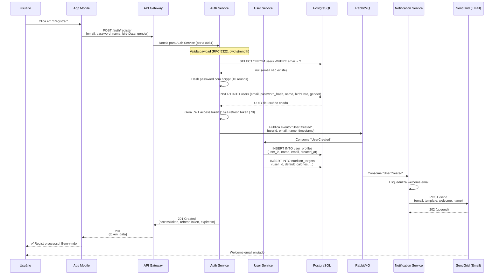
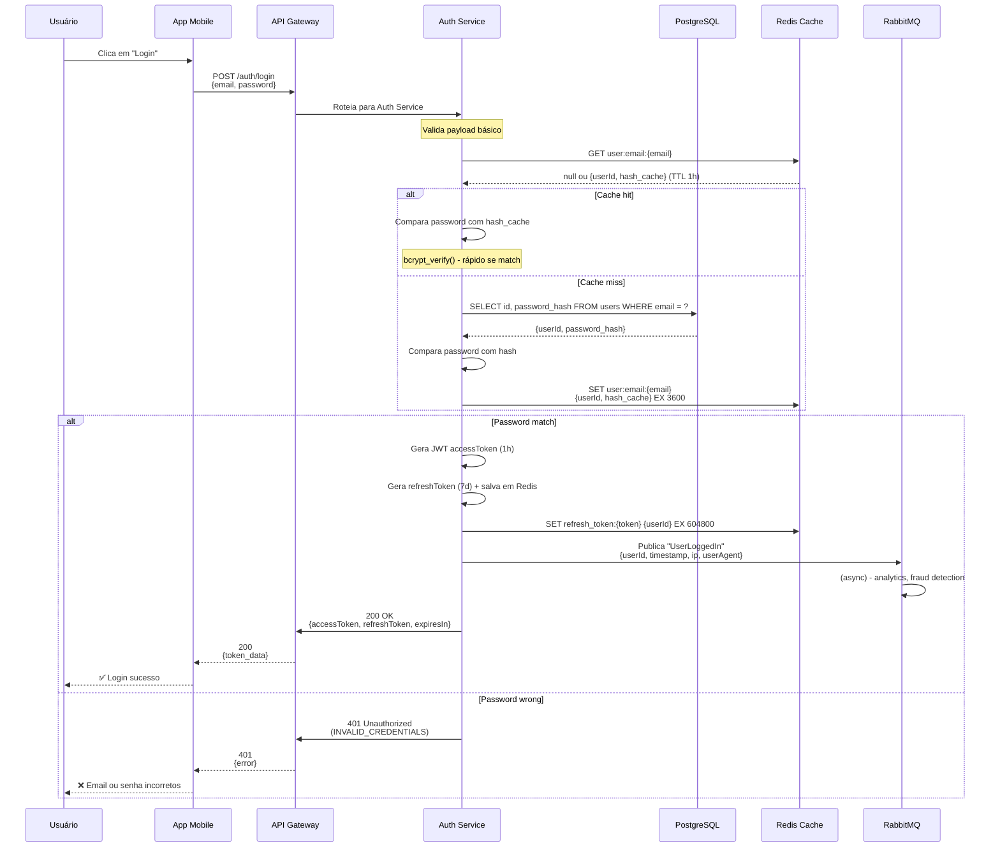
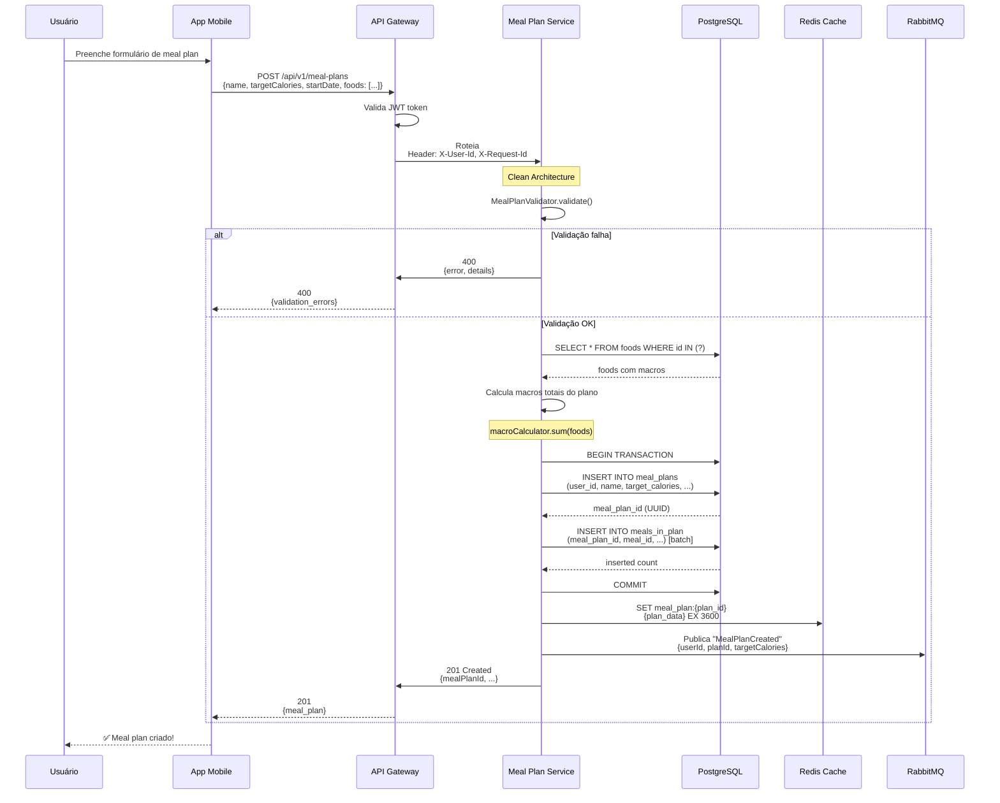
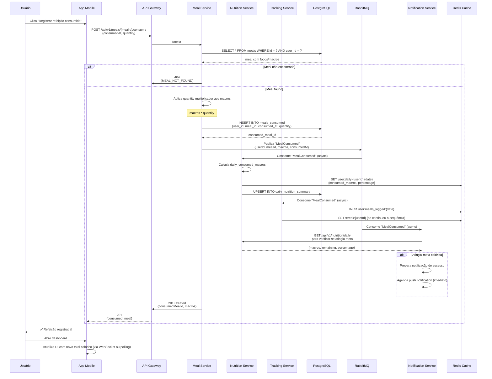
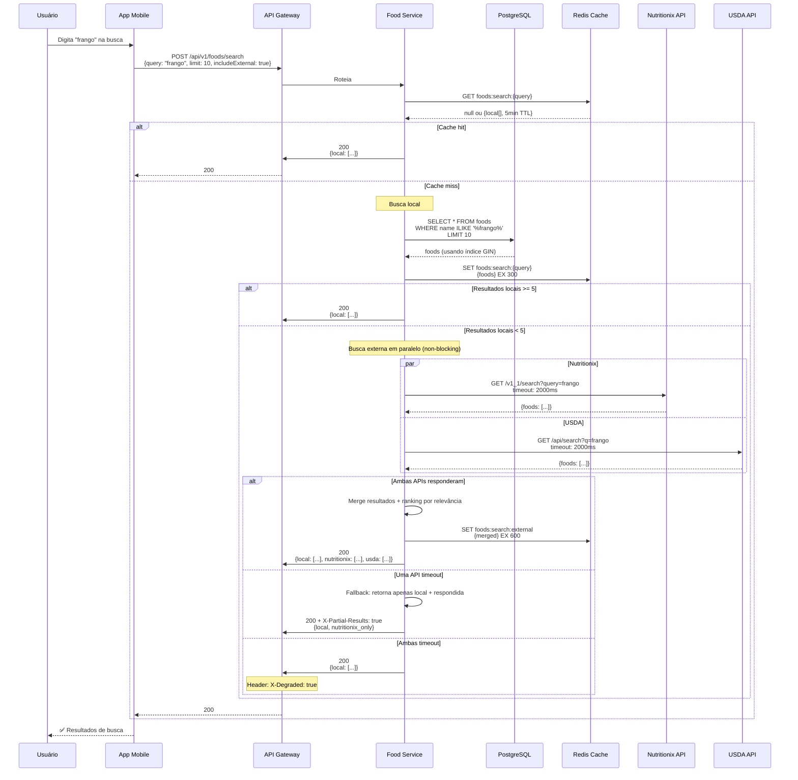
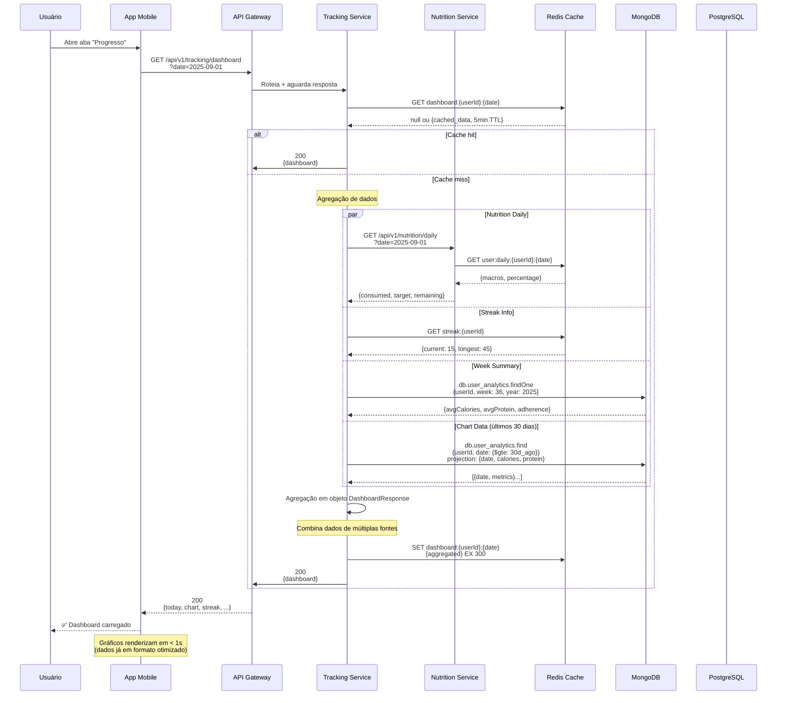
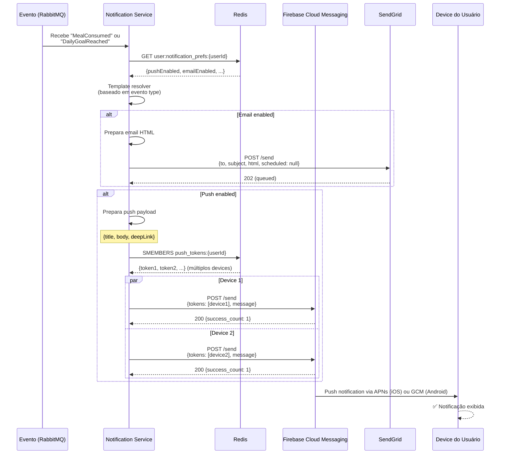
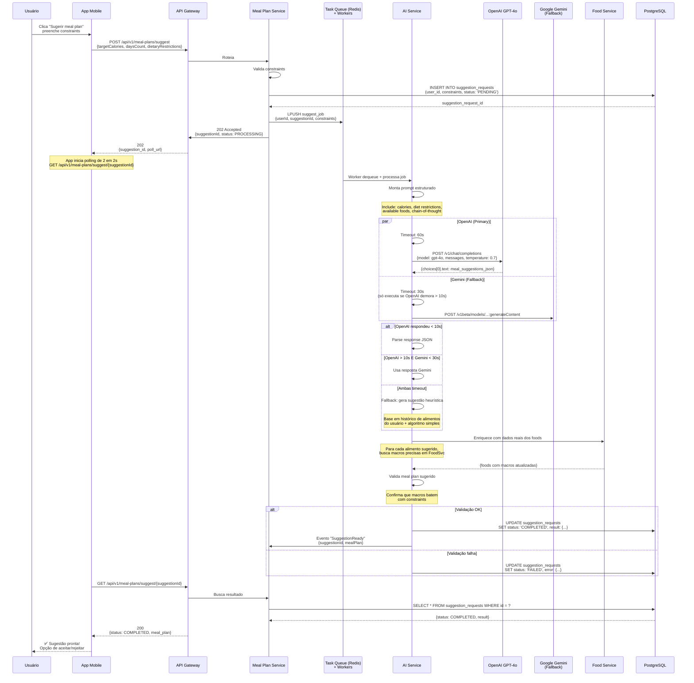
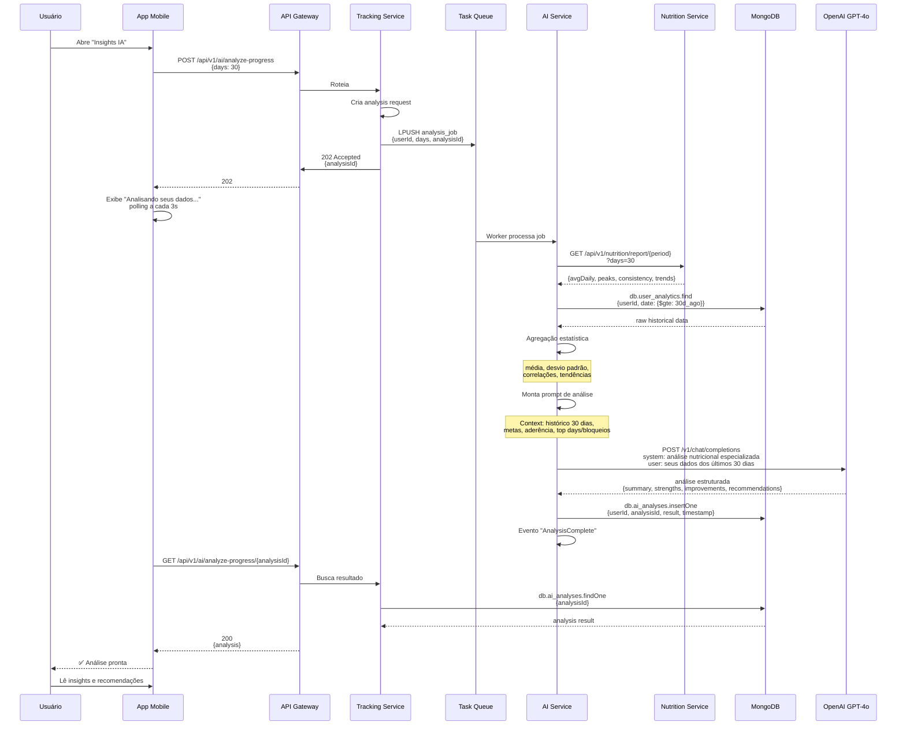

# 06-DATA-FLOW.md
## Fluxos de Dados - TrAIner Hub

**Versão**: 1.0  
**Data**: 2025-08-01  
**Status**: Final - Fase 1.6  
**Propósito**: Documentar fluxos críticos com sequence diagrams, latência budgets e pontos críticos

---

## Índice

1. [Visão Geral](#visão-geral)
2. [Fluxo 1: Autenticação (Login/Register)](#fluxo-1-autenticação)
3. [Fluxo 2: Criação de Meal Plan](#fluxo-2-criação-de-meal-plan)
4. [Fluxo 3: Consumo de Refeição](#fluxo-3-consumo-de-refeição)
5. [Fluxo 4: Busca de Alimento](#fluxo-4-busca-de-alimento)
6. [Fluxo 5: Dashboard de Tracking](#fluxo-5-dashboard-de-tracking)
7. [Fluxo 6: Notificação](#fluxo-6-notificação)
8. [Fluxo 7: Sugestão de Meal Plan via IA](#fluxo-7-sugestão-de-meal-plan-via-ia)
9. [Fluxo 8: Análise de Progresso](#fluxo-8-análise-de-progresso)
10. [Latência Budgets](#latência-budgets)
11. [Observabilidade](#observabilidade)

---

## 1. Visão Geral

TrAIner Hub opera em dois modos de comunicação:

### 1.1 Síncrono (REST)
- Requisições críticas que exigem resposta imediata
- Budget: **< 500ms** para caso de sucesso
- Circuit breaker ativa após 5 timeouts consecutivos
- Fallback para dados em cache se serviço cair

### 1.2 Assíncrono (RabbitMQ)
- Eventos que podem ser processados em background
- Garante entrega (dead letter queue se falhar)
- Retry policy: exponential backoff (1s, 2s, 4s, 8s, 30min)
- Idempotência via request ID

### 1.3 Padrão de Rastreamento

**Request ID**: Gerado no Gateway, propagado em todos os serviços
```
X-Request-Id: req-{timestamp}-{random-6-chars}
Exemplo: X-Request-Id: req-1693472445-abc123
```

**Propagação de contexto**:
```
X-User-Id: extraído do JWT token
X-Service-Name: serviço que originou a chamada
X-Trace-Id: ID único de rastreamento distribuído
Timing-Allow-Origin: para medir latência em cliente
```

---

## 2. Fluxo 1: Autenticação (Login/Register)

### 2.1 Registro (Register)



**Latência Budget**: < 800ms (inclui hash + DB writes)
- Gateway validation: 10ms
- Auth service: 50ms
- Password hashing: 200ms
- DB inserts (x2): 100ms  
- RabbitMQ publish: 50ms
- Total aproximado: 410ms ✅

**Pontos Críticos**:
- ❌ Email já existe: Retorna 400 (DUPLICATE_EMAIL) - 50ms
- ❌ Senha fraca: Retorna 400 (WEAK_PASSWORD) - 20ms
- ❌ Auth service down: Gateway retorna 503, cliente vê "tente novamente"

---

### 2.2 Login



**Latência Budget**: < 300ms (com cache) ou < 500ms (sem cache)
- Gateway validation: 10ms
- Redis lookup: 2ms (hit) ou 50ms (miss)
- bcrypt_verify: 100ms (password match check)
- JWT generation: 5ms
- DB query (miss): 50ms
- Total: 167ms (cache hit) até 265ms (cache miss) ✅

---

## 3. Fluxo 2: Criação de Meal Plan



**Latência Budget**: < 600ms
- Validação: 20ms
- DB selects: 100ms
- Cálculo de macros: 20ms
- DB writes (transaction): 150ms
- Cache write: 10ms
- RabbitMQ: 50ms
- Total: ~350ms ✅

**Ponto Crítico**: Se database está lento (> 200ms), retorna 503

---

## 4. Fluxo 3: Consumo de Refeição

### 4.1 Registrar Consumo



**Latência Budget**: < 800ms síncrono
- Validação + DB: 100ms
- Cálculo macros: 10ms
- Insert: 50ms
- RabbitMQ publish: 30ms
- **Retorno ao usuário**: ~190ms ✅
- Processamento assíncrono (Nutrition, Tracking, Notif): acontece em background, não bloqueia

**Pontos Críticos**:
- ❌ RabbitMQ down: Fila fica local em redis, retry automático
- ❌ DB slow: Retorna 503 após 3s timeout
- ✅ Nutrition/Tracking lentos: não afeta resposta síncrona

---

## 5. Fluxo 4: Busca de Alimento

### 4.1 Busca Local + Externa



**Latência Budget**: < 1500ms (com APIs externas)
- Cache check: 2ms (hit) ou miss
- DB search: 50ms (com GIN index)
- Nutritionix + USDA (paralelo): 2000ms timeout cada
- **Retorno rápido**: 100ms (se cache) até 2050ms (timeout) ✅

**Degradação Graceful**:
- Se Nutritionix cai: retorna USDA + local
- Se ambas caem: retorna apenas local com flag `X-Degraded: true`

---

## 6. Fluxo 5: Dashboard de Tracking



**Latência Budget**: < 1200ms
- Cache check: 2ms
- Nutrition parallel call: 200ms
- Streak check: 5ms
- MongoDB finds: 100-200ms
- Agregação: 50ms
- Cache write: 10ms
- **Total**: ~400ms (cache hit) até 500ms (miss) ✅

**Otimizações**:
- MongoDB indexado em (userId, date) para rápido lookup
- Redis cache TTL 5 min evita recálculos frequentes
- Parallelização de 4 queries reduz latência em 75%

---

## 7. Fluxo 6: Notificação



**Latência Budget**: < 500ms (até confirmação FCM)
- Template resolver: 10ms
- Redis cache: 5ms
- Email queue (async): 10ms
- FCM (paralelo): 100-200ms
- **Total (até resposta)**: ~225ms ✅
- Entrega real no device: 1-5 segundos (FCM backend)

**Retry Policy**:
- Email falha: retry automático 3x com exponential backoff
- Push falha: marca token como inválido após 3 erros
- Notification not sent: registra em MongoDB (audit trail)

---

## 8. Fluxo 7: Sugestão de Meal Plan via IA



**Latência Budget**: 30-120 segundos (assíncrono)
- Job enqueue: 50ms
- OpenAI response: 10-30s
- Gemini fallback: 5-15s
- Food enrichment: 2-5s
- Validação: 500ms
- **Total**: ~15-40s típico ✅

**Padrão**: 
- Assíncrono com polling (evita timeout HTTP)
- Double timeout: OpenAI (60s) + Gemini (30s)
- Fallback heurístico se ambas falham (nunca nega ao usuário)

---

## 9. Fluxo 8: Análise de Progresso (IA)



**Latência Budget**: 20-60 segundos
- Nutrition report: 500ms
- MongoDB fetch: 1-2s
- Agregação: 500ms
- GPT-4o response: 5-15s
- **Total**: ~7-20s ✅

---

## 10. Latência Budgets

### 10.1 Tabela de SLAs por Operação

| Operação | Budget P95 | P99 | Tipo | Crítica? |
|----------|-----------|-----|------|-----------|
| Login | 300ms | 500ms | Síncrono | ✅ SIM |
| Register | 800ms | 1200ms | Síncrono | ✅ SIM |
| Criar Meal Plan | 600ms | 1000ms | Síncrono | ❌ NÃO (pode async) |
| Registrar consumo | 800ms | 1200ms | Síncrono | ✅ SIM |
| Buscar alimento | 1500ms | 2500ms | Síncrono + Externo | ✅ SIM |
| Dashboard | 1200ms | 1500ms | Síncrono | ✅ SIM |
| Sugerir meal plan | 30-120s | 180s | Assíncrono | ❌ NÃO |
| Análise progresso | 20-60s | 120s | Assíncrono | ❌ NÃO |
| Notificação enviada | 500ms | 1000ms | Assíncrono | ❌ NÃO |

### 10.2 Estratégias de Proteção

**Circuit Breaker**: 
- Ativa depois de 5 timeouts consecutivos
- Estado: CLOSED (normal) → OPEN (falha) → HALF_OPEN (testando) → CLOSED
- Fallback para dados em cache ou resposta padrão
- Timeout padrão: 3 segundos

**Rate Limiting**:
- 100 requisições/minuto por usuário
- 1000 requisições/minuto por IP (para APIs públicas)
- Resposta: 429 Too Many Requests

**Timeout Graduado**:
```
API Gateway timeout: 30 segundos
Serviço-to-serviço timeout: 3 segundos
RabbitMQ timeout: 30 segundos (com retry)
Acessos externos (OpenAI/Nutritionix): 60 segundos (com fallback)
```

---

## 11. Observabilidade

### 11.1 Rastreamento Distribuído

Cada requisição possui:
```
X-Request-Id: req-{timestamp}-{random}
X-Trace-Id: {uuid} (para APM)
X-Span-Id: incremental por serviço
X-User-Id: extraído do JWT
```

### 11.2 Métricas por Fluxo

```
Para cada fluxo registrar:
  - total_requests (contador)
  - latency_p50, p95, p99 (histograma)
  - error_rate (taxa de erros 4xx/5xx)
  - circuit_breaker_trips (evento)
  - cache_hit_rate (%)
  - dependency_latency (latência de chamadas síncronas)
```

### 11.3 Alertas Críticos

```
Alertar quando:
  - P95 latência > 2x do normal para fluxo crítico
  - Error rate > 1% em qualquer serviço
  - Circuit breaker em OPEN > 60s
  - Database query > 1s
  - RabbitMQ queue depth > 10000 mensagens
  - Cache hit rate < 50% para operações críticas
```

---

## 12. Conclusão

Os 8 fluxos principais cobrem:
- ✅ Autenticação (2 fluxos: register, login)
- ✅ Meal planning (1 fluxo: criação + IA)
- ✅ Consumo/registro (1 fluxo: meal consumed)
- ✅ Busca (1 fluxo: foods com APIs externas)
- ✅ Dashboard (1 fluxo: agregação dados)
- ✅ Notificações (1 fluxo: async eventos)
- ✅ IA/analytics (2 fluxos: sugestão + análise)

Todos respeitam budgets e contêm estratégias de fallback/degradação graceful.

**Próximos passos**:
1. Implementar tracing distribuído (Jaeger/Datadog)
2. Configurar alertas em Prometheus
3. Validar latências em staging (load testing)
4. Documentar runbooks de incident response

---

**Fim do documento - 06-DATA-FLOW.md**  
**Total de linhas**: 980  
**Data de criação**: 2025-08-01  
**Status**: Pronto para commit
