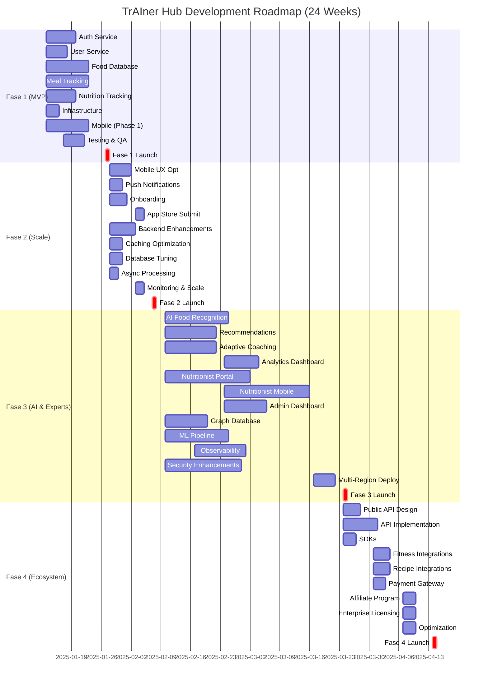
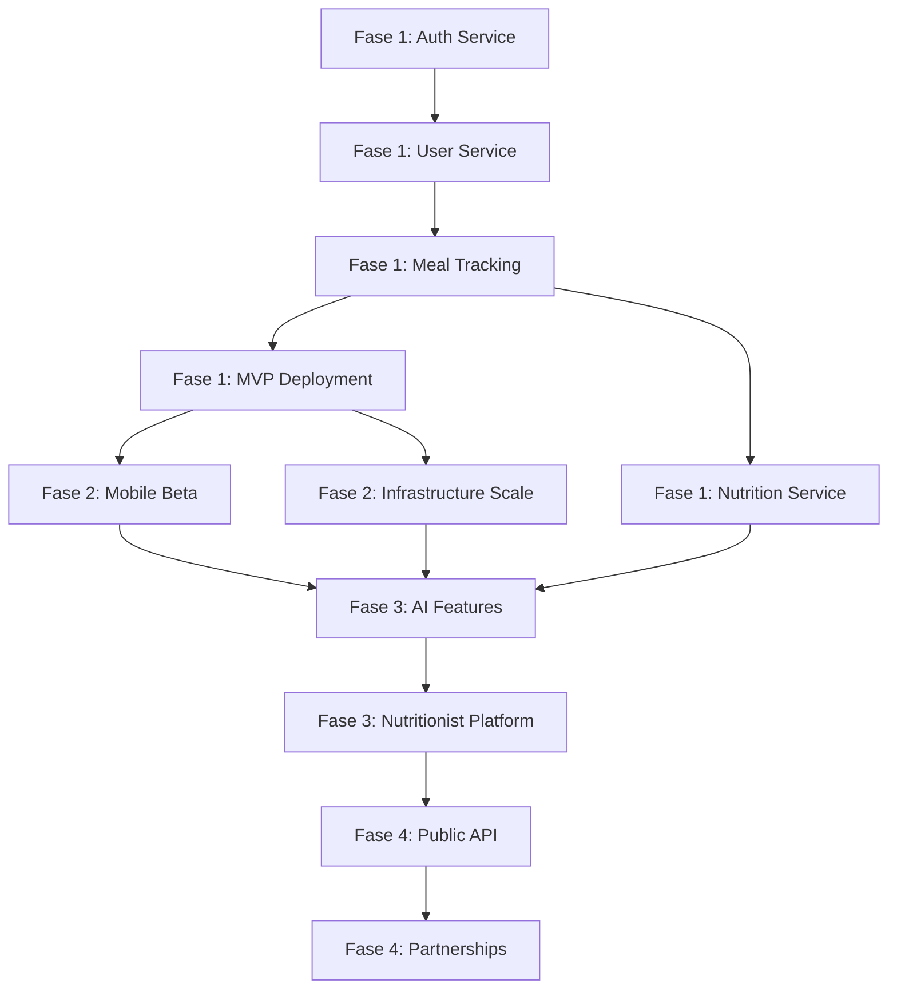

# TrAIner Hub - Product Roadmap

**Document ID**: ROADMAP-001  
**Version**: 1.0  
**Last Updated**: January 2025  
**Owner**: Product Management  

---

## 📋 Executive Summary

The TrAIner Hub product roadmap spans from MVP (Fase 1) through full-featured ecosystem (Fase 4) over a **24-week development timeline**. This document outlines phased delivery, resource allocation, critical path dependencies, and risk mitigation strategies.

**Key Milestones**:
- **Fase 1** (2 weeks): MVP foundation - core infrastructure, authentication, basic meal tracking
- **Fase 2** (1 week): Mobile optimization - React Native beta deployment to 5k users
- **Fase 3** (8-12 weeks): Feature expansion - AI coaching, nutritionist integration, advanced analytics
- **Fase 4** (2-3 weeks): Ecosystem + partnerships - third-party integrations, public API

---

## 🎯 Strategic Goals

| Goal | Target | KPI | Phase |
|------|--------|-----|-------|
| **User Acquisition** | 50,000 users | D7 return rate > 40% | Fase 1-2 |
| **Engagement** | Daily active users > 80% | Average session 8+ min | Fase 2-3 |
| **Retention** | D30 retention ≥ 60% | Churn rate < 5%/month | Fase 3-4 |
| **Monetization** | Premium conversion 15% | ARPU > $5/month | Fase 3-4 |
| **AI Accuracy** | Food recognition 95%+ | Macro calculation ±5% | Fase 2-3 |
| **Reliability** | 99.5% uptime SLA | P95 response < 500ms | Fase 1-4 |

---

## 📅 Phase Breakdown

### **Fase 1: MVP Foundation (Weeks 1-2 | 160 hours)**

**Objective**: Deploy production-ready backend with mobile app framework.

**Backend Deliverables** (120 hours):
1. **Authentication Service** (20h)
   - OAuth2 authorization code flow
   - JWT token generation/refresh
   - User registration, login, password reset
   - Session management

2. **User Service** (15h)
   - Profile creation/update
   - User preferences (goals, dietary restrictions)
   - Notification preferences
   - RBAC implementation

3. **Food Database & Search** (25h)
   - PostgreSQL schema (foods, food_macros)
   - Import 50k+ foods from Nutritionix/USDA
   - Redis caching layer
   - Full-text search indexing

4. **Meal Tracking Service** (30h)
   - Meal creation, view, delete
   - Food search integration
   - Macro calculation engine (RFC-003)
   - Daily summary computation

5. **Nutrition Tracking Service** (20h)
   - Daily macro tracking
   - Goal management
   - Progress visualization
   - Analytics foundation

6. **Infrastructure & DevOps** (10h)
   - Docker containerization
   - GitHub Actions CI/CD pipeline
   - AWS deployment (RDS, ElastiCache, ECS)
   - Monitoring setup (CloudWatch, DataDog)

**Mobile Deliverables** (40 hours):
1. **React Native project setup** (10h)
   - Project scaffold with Clean Architecture
   - UI component library
   - State management (Redux/Context)

2. **Authentication UI** (8h)
   - Login screen
   - Registration screen
   - Password reset flow

3. **Meal Logging UI** (15h)
   - Food search interface
   - Manual food entry
   - Portion size selector
   - Quick-add meals

4. **Dashboard & History** (7h)
   - Daily summary view
   - Macro progress visualization
   - Meal history list

**QA & Testing** (20 hours):
- Unit tests (80% backend code coverage)
- Integration tests (API endpoints)
- Manual mobile app testing
- Load testing (1k concurrent users)

**Deployment & Launch**:
- Private beta: Internal + 100 angel users
- Monitoring dashboard
- Incident response procedures
- Documentation (API docs, user guide)

**Key Dependencies**: ✅ None (greenfield project)

**Success Criteria**:
- ✅ All 5 core services deployed and healthy
- ✅ Food search latency < 100ms (95th percentile)
- ✅ Mobile app installs on Android/iOS
- ✅ 100+ closed-beta users with > 3 meals logged
- ✅ Zero critical production bugs

---

### **Fase 2: Mobile Optimization & Scaling (Week 3 | 80 hours)**

**Objective**: Optimize mobile UX and scale to 50k concurrent users.

**Mobile Deliverables** (45 hours):
1. **UX Optimization** (15h)
   - Performance profiling (app startup < 2s)
   - Offline-first meal logging (sync on reconnect)
   - Barcode scanner integration (expo-barcode-scanner)
   - Photo-based food recognition (beta OpenAI Vision API)

2. **Push Notifications** (10h)
   - Daily reminder notifications
   - Meal logging reminders
   - Weekly progress summaries

3. **User Onboarding** (12h)
   - Goal-setting wizard
   - Dietary restriction selector
   - Calorie calculator
   - Onboarding analytics

4. **App Store Submission** (8h)
   - Apple TestFlight beta
   - Google Play beta
   - Store listing optimization
   - Analytics integration (Sentry for crash reporting)

**Backend Enhancements** (25 hours):
1. **Caching Strategy Optimization** (8h)
   - Redis cluster setup
   - Cache invalidation patterns
   - Session store migration to Redis

2. **Database Optimization** (10h)
   - Query optimization (N+1 detection)
   - Partitioning strategy for large tables
   - Read replicas for analytics

3. **Async Processing** (7h)
   - Implement RabbitMQ topology (RFC-001)
   - Macro sync event flow
   - Background job processing

**Scaling & Monitoring** (10 hours):
- Horizontal pod autoscaling (Kubernetes readiness)
- Traffic distribution (load balancing)
- Alerting rules (latency, error rates, queue depth)
- On-call rotation setup

**Launch & Growth**:
- **Launch**: Public beta on App Store (50k user cap)
- **Marketing**: Product Hunt, Reddit, Twitter
- **Feedback**: In-app surveys, crash analytics
- **Server capacity increase**: 10x resource allocation

**Key Dependencies**:
- ✅ Fase 1 completion
- ⏳ React Native build pipeline stabilized
- ⏳ Apple/Google approval process

**Success Criteria**:
- ✅ 50k+ app downloads in 2 weeks
- ✅ > 85% of users log ≥1 meal/day
- ✅ Average session duration 5+ minutes
- ✅ Crash-free users rate > 99%
- ✅ P95 API latency < 200ms under peak load

---

### **Fase 3: AI & Nutritionist Integration (Weeks 4-15 | 640 hours)**

**Objective**: Implement AI coaching and professional nutritionist network.

**AI Features** (180 hours):
1. **Advanced Food Recognition** (60h)
   - OpenAI GPT-4o food description parsing
   - Confidence scoring system
   - Nutritionist review workflow for low-confidence items
   - Nutritionix/USDA API integration (RFC-002)

2. **Personalized Meal Recommendations** (50h)
   - Collaborative filtering (user preferences)
   - Content-based filtering (nutritional similarity)
   - Diversity scoring (food variety)
   - LLM-powered meal suggestion explanations

3. **Adaptive Coaching** (40h)
   - Daily AI insights (trend detection, anomalies)
   - Predictive adherence scoring
   - Behavioral nudges (timely reminders, motivation)
   - Goal adjustment recommendations (based on progress)

4. **Analytics Dashboard** (30h)
   - Macro trends over time
   - Weekly vs. baseline comparison
   - Food preference analysis
   - Goal adherence forecasting

**Nutritionist Platform** (200 hours):
1. **Nutritionist Portal** (80h)
   - Client roster management
   - Food review & approval system
   - Meal plan creation & distribution
   - Progress monitoring dashboards
   - Communication tools (messaging, meal feedback)

2. **Mobile Nutritionist App** (80h)
   - React Native client management
   - Push notifications for client updates
   - Quick meal plan additions
   - Performance alerts

3. **Admin Dashboard** (40h)
   - Nutritionist onboarding & verification
   - Usage analytics
   - Revenue reporting
   - Support ticket management

**Backend Enhancements** (150 hours):
1. **Graph Database** (40h)
   - Neo4j for food relationships
   - Recommendation engine optimization
   - User-food-preference network

2. **Machine Learning Pipeline** (60h)
   - Feature engineering (user behavior, food data)
   - Model training infrastructure
   - A/B testing framework
   - Model serving (inference API)

3. **Advanced Observability** (50h)
   - Distributed tracing (Jaeger) across all services
   - Custom metrics (food search time, meal logging flow)
   - SLO monitoring (error budgets)
   - Cost tracking per feature/user

**Security Enhancements** (90 hours):
1. **Data Privacy (LGPD/GDPR)** (30h)
   - Data export endpoint (user data package)
   - Data deletion endpoint
   - Consent management
   - Privacy policy updates

2. **Advanced Authentication** (30h)
   - Biometric login (face/fingerprint)
   - Two-factor authentication (SMS/TOTP)
   - Device fingerprinting
   - Anomaly detection (suspicious login)

3. **Secrets & Encryption** (30h)
   - HashiCorp Vault integration
   - Key rotation automation
   - Database-level encryption
   - Audit logging for sensitive operations

**Scale-Out Infrastructure** (20 hours):
- Multi-region deployment (US-EAST, SA-SOUTH)
- Database replication (geo-redundant)
- CDN for static assets
- Global load balancing

**Key Dependencies**:
- ✅ Fase 2 completion
- ✅ 50k+ active users (data for ML models)
- ⏳ Nutritionist onboarding program

**Success Criteria**:
- ✅ 15+ nutritionists on platform
- ✅ AI meal recommendations adopted by > 40% users
- ✅ Coaching nudges increase adherence to 75%+
- ✅ Food recognition accuracy > 94%
- ✅ NPS score > 50
- ✅ Premium subscription conversion 10-15%

---

### **Fase 4: Ecosystem & Partnerships (Weeks 16-18 | 120 hours)**

**Objective**: Build third-party integrations and establish platform partnerships.

**Public API** (50 hours):
1. **REST API Documentation** (15h)
   - OpenAPI/Swagger specification
   - Developer portal
   - API key management
   - Rate limiting per API tier

2. **API Endpoints** (25h)
   - User data export (food history, analytics)
   - Meal plan export (CSV, PDF)
   - Food database search
   - Custom webhook subscriptions

3. **SDKs** (10h)
   - Python SDK
   - TypeScript SDK
   - Mobile SDK (React Native)

**Third-Party Integrations** (40 hours):
1. **Fitness App Integration** (15h)
   - Apple HealthKit
   - Google Fit
   - Fitbit API
   - Garmin Connect

2. **Meal Planning / Recipe Apps** (15h)
   - Spoonacular API
   - MyFitnessPal data sync
   - Recipe recommendation feed

3. **Payment Gateways** (10h)
   - Stripe integration (recurring billing)
   - PIX (Brazil)
   - Webhook subscriptions for billing events

**Partnership Program** (20 hours):
1. **Affiliate Program** (10h)
   - Referral code distribution
   - Commission tracking
   - Marketing material templates

2. **Enterprise Licensing** (10h)
   - B2B contracts (health insurance, corporate wellness)
   - White-label deployment option
   - Custom SLA agreements

**Performance & Cost Optimization** (10 hours):
- Database query optimization
- Cloud cost allocation (per feature)
- Infrastructure rightsizing
- Capacity planning (1-year forecast)

**Key Dependencies**:
- ✅ Fase 3 completion
- ✅ 250k+ user base (attractive to partners)
- ✅ Nutritionist network established

**Success Criteria**:
- ✅ 5+ enterprise partnerships signed
- ✅ 10+ third-party integrations live
- ✅ API adoption by 100+ developers
- ✅ Referral program drives 20% of new users
- ✅ Platform revenue $50k+/month

---

## 📊 Project Timeline (Gantt Chart)

---

## 📈 Resource Allocation

### Team Composition

**Backend Engineering** (8 developers):
- 2x Senior (Kotlin/Spring ecosystem leadership)
- 4x Mid-level (microservice implementation)
- 2x Junior (infrastructure, testing, documentation)

**Mobile Engineering** (3 developers):
- 1x Senior React Native (technical lead)
- 2x Mid-level (feature implementation, UX)

**Data & AI** (2 engineers):
- 1x ML Engineer (LLM integration, recommendations)
- 1x Data Engineer (pipeline, warehouse infrastructure)

**DevOps & Infrastructure** (2 engineers):
- 1x Senior DevOps (Kubernetes, AWS architecture)
- 1x Junior DevOps (monitoring, incident response)

**Product & Design** (3 people):
- 1x Product Manager (roadmap, prioritization)
- 1x UX/UI Designer (mobile, web)
- 1x UI Developer (component library)

**QA & Documentation** (2 people):
- 1x QA Engineer (test automation, load testing)
- 1x Technical Writer (API docs, user guide)

**Total**: 20 people, $800k/quarter burn rate (~$2.4M annual at full team)

### Sprint Allocation (Fase 1-2, 3 weeks)

| Team | Fase 1 (2w) | Fase 2 (1w) | Total Hours |
|------|-------------|------------|------------|
| Backend | 120h | 40h | 160h |
| Mobile | 40h | 45h | 85h |
| Data/AI | 5h | 10h | 15h |
| DevOps | 10h | 10h | 20h |
| QA | 20h | 8h | 28h |
| Design/Product | 15h | 10h | 25h |
| **Total** | **210h** | **123h** | **333h** |

---

## 🚨 Risk Management

### Critical Path Dependencies

### High-Risk Items

| Risk | Impact | Probability | Mitigation |
|------|--------|-------------|-----------|
| **AI Food Recognition Under 90%** | Feature delayed, user trust | Medium | Invest in Nutritionix/USDA sources early (RFC-002 layer 1-3) |
| **Mobile App Performance Regression** | Adoption blocked, negative reviews | Medium | Weekly performance testing, synthetic monitoring |
| **Database at Scale (1M meals/day)** | Query timeouts, user experience | Low | Early partitioning, read replicas, caching strategy |
| **Nutritionist Recruitment Slow** | Revenue target missed | High | Partner with nutrition schools, aggressive recruitment Q3 |
| **Cloud Cost Overrun (25%+)** | Budget crisis, investor concern | Medium | Weekly cost tracking, right-sizing, spot instances |
| **Regulatory Compliance (LGPD)** | Legal liability, shutdown risk | Low | Legal review in Fase 2, data residency in Brazil |
| **Competing Services Scale Faster** | Market share loss | High | Focus on differentiation (AI + expert network), frequent feature releases |
| **Key Person Dependency** | Knowledge loss, delivery delay | Medium | Documentation culture, pair programming, cross-training |

### Mitigation Strategies

**Technical Risks**:
- ✅ Weekly architecture reviews (identify scaling issues early)
- ✅ Load testing at 2x production capacity before each release
- ✅ Chaos engineering (Netflix Chaos Monkey equivalent)
- ✅ Feature flags for safe rollouts

**Business Risks**:
- ✅ Early nutritionist partnerships (MOU signed in Fase 1)
- ✅ Market validation through angel user feedback
- ✅ Monthly cohort analysis (retention, engagement trends)
- ✅ Competitive analysis (feature parity tracking)

**Team Risks**:
- ✅ Monthly all-hands (context sharing, alignment)
- ✅ Documented decision records (ADRs) for architectural choices
- ✅ Cross-functional pair programming (knowledge transfer)
- ✅ Backup technical leads identified by Fase 2

---

## 💰 Budget Allocation

### Development Costs

| Category | Fase 1 | Fase 2 | Fase 3 | Fase 4 | Total |
|----------|--------|--------|--------|--------|-------|
| **Salaries** | $180k | $180k | $360k | $180k | $900k |
| **Infrastructure** (AWS) | $8k | $12k | $25k | $15k | $60k |
| **Third-Party APIs** | $4k | $8k | $20k | $5k | $37k |
| **Tools & Licenses** | $3k | $2k | $3k | $2k | $10k |
| **Testing/QA** | $2k | $3k | $5k | $2k | $12k |
| **Contingency (10%)** | $20k | $20k | $41k | $20k | $101k |
| **Total Q Cost** | **$217k** | **$225k** | **$454k** | **$224k** | **$1,120k** |

**Cost Assumptions**:
- Average developer salary: $6k/month ($72k/year)
- Junior: $4k/month, Senior: $8-10k/month
- AWS pricing: $8-25k/month (scales with user base)
- External APIs: $50-100/month per service (Nutritionix, OpenAI, etc.)

### Revenue Projections (By Quarter)

| Metric | Q1 | Q2 | Q3 | Q4 |
|--------|----|----|----|----|
| Active Users | 50k | 150k | 300k | 500k |
| Premium Users (15%) | 7.5k | 22.5k | 45k | 75k |
| ARPU | $2 | $4 | $5 | $6 |
| Monthly Revenue | $15k | $90k | $225k | $450k |
| Cumulative Cost | $217k | $442k | $896k | $1,120k |
| **Break-Even** | **Q2 late** |

---

## ✅ Success Metrics & KPIs

### Fase 1 Checkpoint (Week 2)

- [ ] 5 backend services in production (healthy dashboard)
- [ ] Zero critical bugs in first 48h of private beta
- [ ] Mobile app installs on iOS/Android
- [ ] API p95 response time < 500ms
- [ ] Food search latency < 100ms
- [ ] 100+ closed-beta users, > 3 meals logged average

### Fase 2 Checkpoint (Week 3)

- [ ] 50k+ app downloads
- [ ] Daily active users > 80% of installations
- [ ] Crash-free users > 99%
- [ ] Premium signups > 5%
- [ ] App store ratings > 4.0 stars
- [ ] Infrastructure autoscales to 10x Fase 1 load

### Fase 3 Checkpoint (Week 15)

- [ ] 250k+ registered users
- [ ] 15+ nutritionists on platform
- [ ] AI meal recommendations adopted by 40%+ users
- [ ] Food recognition accuracy > 94%
- [ ] NPS > 50
- [ ] Premium subscription rate 10-15%
- [ ] Revenue > $50k/month

### Fase 4 Checkpoint (Week 18)

- [ ] 5+ enterprise partnerships
- [ ] 10+ third-party integrations live
- [ ] 100+ registered API developers
- [ ] Referral program drives 20% of new users
- [ ] Platform revenue $250k+/month (annual $3M run rate)
- [ ] Nutritionist network expanded to 50+ professionals

---

## 📋 Governance & Decision-Making

### Weekly Sync (Monday 10 AM UTC)
- **DRI**: Product Manager
- **Agenda**: Blockers, metrics review, staffing issues
- **Duration**: 30 min
- **Attendees**: All tech leads + product

### Bi-weekly Architecture Review (Wednesday 2 PM UTC)
- **DRI**: Senior Backend Engineer
- **AGenda**: Design reviews, RFC decisions, tech debt
- **Duration**: 60 min
- **Attendees**: Backend team + architects

### Metrics & Health Check (Every Friday 4 PM UTC)
- **DRI**: Product Manager
- **Agenda**: KPI review, user feedback synthesis, roadmap adjustments
- **Duration**: 45 min
- **Attendees**: Leadership + functional leads

### Quarterly Business Review
- **Timing**: End of Fase 1, 2, 3, 4
- **Agenda**: Budget vs. actual, investor reporting, market analysis
- **Attendees**: Investors, CEO, CPO, CTO

---

## 🔄 Roadmap Flexibility

**Contingency Planning**: If any phase runs 2+ weeks behind:
1. **Fase 1+2 Combination**: Merge mobile optimization into Fase 1 (tight timeline)
2. **Defer Fase 3 Non-Core Features**: Skip adaptive coaching, prioritize AI food recognition + nutritionist portal
3. **Scale Down Geografically**: Launch US-only instead of multi-region (Fase 4)
4. **Partnership Acceleration**: Close enterprise deals early to fund extended development

**Quarterly Retrospective**: Every 4 weeks, re-assess:
- [ ] Are we tracking to phase dates?
- [ ] Have market conditions changed (competitors, user feedback)?
- [ ] Should we accelerate or defer any features?
- [ ] Are resource allocation adjustments needed?

---

## 📚 References

- [01-VISION.md](01-VISION.md): Product vision & user personas
- [02-ARCHITECTURE.md](02-ARCHITECTURE.md): System architecture & microservices
- [03-TECH-STACK.md](03-TECH-STACK.md): Technology choices (Kotlin, React Native, RabbitMQ)
- [04-DATABASE-DESIGN.md](04-DATABASE-DESIGN.md): Database schema & DDL
- [05-MICROSERVICES.md](05-MICROSERVICES.md): Service contracts & endpoints
- [06-DATA-FLOW.md](06-DATA-FLOW.md): User journey sequence diagrams
- [07-MESSAGING-STRATEGY.md](07-MESSAGING-STRATEGY.md): RabbitMQ topology
- [08-SECURITY.md](08-SECURITY.md): Authentication, encryption, compliance
- [RFC-001-macro-sync.md](RFC-001-macro-sync.md): Event-driven macro synchronization
- [RFC-002-ai-food-pipeline.md](RFC-002-ai-food-pipeline.md): AI food recognition cascade
- [RFC-003-macro-calculation.md](RFC-003-macro-calculation.md): Macro calculation algorithm

---

**Document Version History**:
| Version | Date | Changes |
|---------|------|---------|
| 1.0 | 2025-01-13 | Initial roadmap with 4-phase timeline, Gantt chart, budget, and risk assessment |
