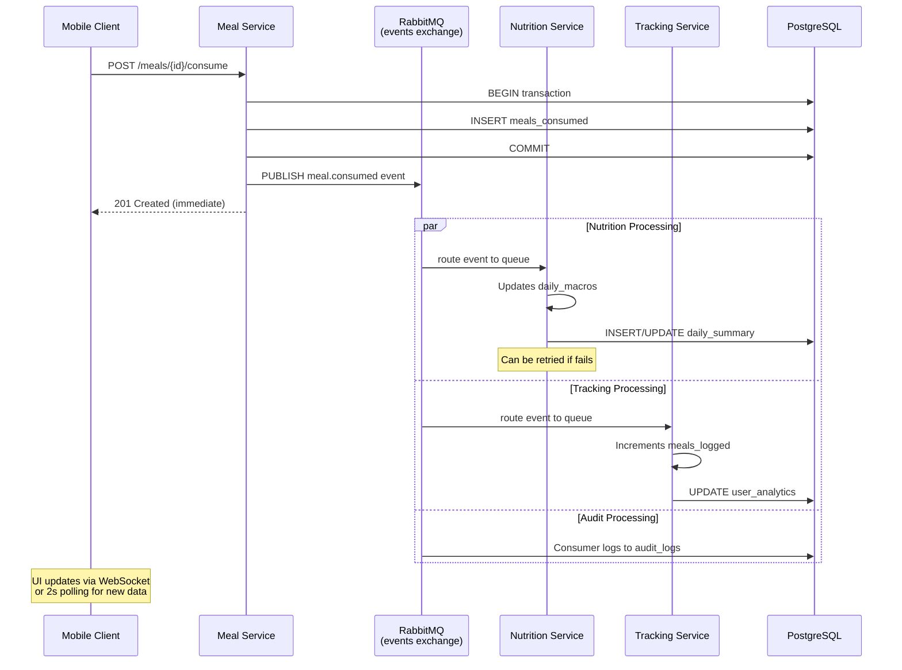

# RFC-001: Macro Synchronization Strategy

**Title**: Event-Driven Macro Synchronization Across Services  
**Date**: 2025-08-01  
**Status**: ACCEPTED  
**Author**: Architecture Team  
**Reviewers**: Backend, Nutrition, System Design  

---

## 1. Abstract

Define strategy for keeping macro nutrient data (calories, protein, carbs, fat) synchronized across TrAIner Hub services when meal consumption events occur.

**Key Decision**: Use **event-driven eventual consistency** (RabbitMQ) instead of synchronous REST calls.

**Impact**:
- Resilience: Nutrition service downtime doesn't block meal consumption
- Scalability: Async processing enables batching
- Complexity: Eventually consistent (brief delays acceptable)

---

## 2. Problem Statement

When a user consumes a meal:
1. Meal service records consumption
2. Nutrition service must update daily_macros
3. Tracking service must increment meals_logged
4. Notification service may send alerts

**Current Challenge**: These services need synchronized data, but synchronous REST calls create:
- ❌ Coupling (Meal service depends on Nutrition service)
- ❌ Cascading failures (Nutrition down → meal registration fails)
- ❌ Longer latency (3+ sequential REST calls)

**Desired Outcome**: Decouple services while maintaining eventual consistency.

---

## 3. Options Considered

### Option A: Synchronous REST Calls (Request-Response)

```
POST /api/v1/meals/{mealId}/consume
  ↓
Meal Service:
  1. INSERT INTO meals_consumed
  2. REST POST → Nutrition Service (calculate macros)
  3. REST POST → Tracking Service (log meal)
  4. REST POST → Notification Service (check alerts)
  ↓
Return response to client
```

**Pros**:
- ✅ Immediate consistency
- ✅ Client knows if entirely successful

**Cons**:
- ❌ Coupling (Meal Service must know Nutrition/Tracking/Notification endpoints)
- ❌ Failure cascades (if Nutrition down, meal registration fails)
- ❌ Higher latency (multiple round-trips)
- ❌ Scalability (blocking I/O on each call)
- ❌ Difficult to retry individual failures

**Verdict**: ❌ Not suitable for TrAIner Hub

---

### Option B: Polling (Nutrition Fetches Latest Meals)

```
Meal Service:
  1. INSERT INTO meals_consumed
  2. Return immediately

Nutrition Service (background job every 30sec):
  SELECT * FROM meals_consumed
  WHERE processed = false
  AND created_at > last_check
```

**Pros**:
- ✅ Decoupled (Nutrition service polls independently)
- ✅ No external event broker needed

**Cons**:
- ❌ High latency (up to 30sec delay for updates)
- ❌ Unnecessary database load (constant polling)
- ❌ Duplicate processing (need `processed` flag management)
- ❌ Difficult to scale (coordinator pattern needed for multiple workers)

**Verdict**: ❌ Latency too high for real-time dashboard updates

---

### Option C: Event-Driven (RabbitMQ) ← **CHOSEN**

```
POST /api/v1/meals/{mealId}/consume
  ↓
Meal Service:
  1. INSERT INTO meals_consumed (transaction)
  2. PUBLISH event: "meal.consumed"
  3. Return 201 to client immediately
  ↓
RabbitMQ routes to:
  ├─ Nutrition Service queue →  update daily_macros (async)
  ├─ Tracking Service queue →   increment meals_logged (async)
  ├─ Notification queue →        check alerts (async)
  └─ Audit queue →               log event (async)
```

**Pros**:
- ✅ Decoupled (Meal Service only publishes event, doesn't depend on others)
- ✅ Resilient (if Nutrition down, message queues, retries when back)
- ✅ Low latency for client (return after insert, before processing)
- ✅ Scalable (use prefetch + parallel workers for throughput)
- ✅ Observable (audit trail of all events)
- ✅ Replayable (can reprocess events if bug found)

**Cons**:
- ⚠️ Eventual consistency (brief delay before aggregates sync)
- ⚠️ Increased complexity (need event contracts, retries, DLQ)
- ⚠️ Operational overhead (manage RabbitMQ cluster)
- ⚠️ Testing complexity (async testing harder)

**Verdict**: ✅ **SELECTED** - Best trade-off for TrAIner Hub

---

## 4. Decision: Event-Driven Eventual Consistency

### 4.1 Implementation



### 4.2 Event Contract

```json
{
  "eventId": "evt-uuid-1693472560",
  "eventType": "meal.consumed",
  "version": 1,
  "aggregateId": "consumed-meal-uuid",
  "timestamp": "2025-08-01T12:30:00Z",
  "correlationId": "req-xyz-123",
  "source": "meal-service",
  "data": {
    "consumedMealId": "uuid",
    "userId": "user-uuid",
    "mealId": "meal-uuid",
    "consumedAt": "2025-08-01T12:30:00Z",
    "quantity": 1.0,
    "macros": {
      "calories": 550,
      "protein": 30,
      "carbs": 45,
      "fat": 15
    }
  }
}
```

### 4.3 Consistency Window

**Maximum eventual consistency delay**: 5 seconds (under normal conditions)

```
Timeline:
T=0ms:    Client POST /meals/{id}/consume
T=10ms:   Meal Service INSERT + PUBLISH
T=15ms:   Client receives 201 response
T=100ms:  Nutrition Service processes event
T=150ms:  Nutrition updates cache
T=200ms:  User opens dashboard (sees updated total)
```

**Acceptable?** ✅ Yes - for consumer-facing features, 100-200ms delay is imperceptible

**When is this a problem?** Only if user:
1. Logs meal at 12:30:00
2. Immediately checks daily total
3. On rare slow network (> 5sec delay)

**Mitigation**: Dashboard shows cached estimate while fetching real data

---

## 5. Idempotency & Deduplication

RabbitMQ cannot guarantee exactly-once delivery (message may be processed twice if service crashes after consume but before ack).

**Solution**: Idempotent consumption

```kotlin
// Nutrition Service - Idempotent handler

@RabbitListener(queues = ["trainer_hub.nutrition.events"])
fun handleMealConsumed(event: MealEvent) {
    
    // Check if already processed
    val processed = idempotencyCache.contains(event.eventId)
    if (processed) {
        log.info("Event ${event.eventId} already processed, skipping")
        return  // Just acknowledge and skip
    }
    
    try {
        // Process event
        updateDailyMacros(event)
        
        // Only after successful processing, mark as processed
        // (use atomic operation to avoid race conditions)
        idempotencyCache.set(event.eventId, true, TTL=24hours)
        
    } catch (e: Exception) {
        // If error, don't mark as processed
        // Will be retried on next broker connection
        throw e
    }
}

// Idempotency table (PostgreSQL)
CREATE TABLE idempotent_events (
    event_id UUID PRIMARY KEY,
    service_name VARCHAR(100) NOT NULL,
    processed_at TIMESTAMP DEFAULT NOW()
);
```

---

## 6. Failure Scenarios & Recovery

### 6.1 Nutrition Service Crashes

```
Timeline:
T=0:    Meal consumed, event published
T=1s:   Nutrition service crashed
T=2-10s: Message sits in queue with retries
T=30s:  Nutrition service restarted
T=31s:  Nutrition service reconnects to RabbitMQ
T=32s:  Message reprocessed from queue
T=100s: User opens app, sees correct daily total
```

✅ **Result**: Self-healing via queue recovery

### 6.2 RabbitMQ Crashes

```
Timeline:
T=0:    Meal consumed, event published (durably persisted to disk)
T=5s:   RabbitMQ cluster crashes
T=~5m:  Ops team notices, restarts RabbitMQ
T=6m:   RabbitMQ back online, re-delivers persisted messages
T=6m30s: Services process messages normally
```

✅ **Result**: Durable queue protects against broker failure

### 6.3 Message Processing Fails

```
Scenario: Nutrition service has bug, throws exception

Timeline:
T=0:    Meal consumed
T=1s:   Event routed to Nutrition service
T=1.5s: ProcessingException thrown
T=1.6s: NACK (negative acknowledge) sent
T=2s:   Retry 1 (exponential backoff: 1 second)
T=3s:   Retry 2 (exponential backoff: 4 seconds)
T=7s:   Retry 3 (exponential backoff: 16 seconds)
T=23s:  Final failure → DLQ (dead letter queue)
T=24s:  Ops alerted ("Messag in DLQ, investigate")
T=30m:  Bug fixed + code deployed
T=31m:  Ops replay event from DLQ
T=31.1: Macro updated correctly
```

✅ **Result**: DLQ prevents message loss, enables manual recovery

---

## 7. Testing Strategy

### 7.1 Unit Tests

```kotlin
@Test
fun testMealConsumedEventPublished() {
    // When
    val consumedMeal = mealService.consumeMeal(mealId, userId)
    
    // Then
    val captor = ArgumentCaptor<MealEvent>()
    verify(eventPublisher).publish(captor.capture())
    
    val publishedEvent = captor.value
    assertThat(publishedEvent.eventType).isEqualTo("meal.consumed")
    assertThat(publishedEvent.data.macros.calories).isEqualTo(550)
}
```

### 7.2 Integration Tests (RabbitMQ Container)

```kotlin
@Test
@RabbitListener(queues = ["test-queue"])
fun testMealEventProcessing() {
    // Given: RabbitMQ container running
    
    val event = MealEvent(userId, mealId, 550, ...)
    rabbitTemplate.convertAndSend("trainer_hub.events", "meal.consumed", event)
    
    // When
    Thread.sleep(2000)  // Wait for processing
    
    // Then
    val dailySummary = nutritionService.getDailyMacros(userId)
    assertThat(dailySummary.calories).isEqualToOrGreaterThan(550)
}
```

### 7.3 Chaos Testing

```
Use Toxiproxy to simulate failures:
  1. Disconnect RabbitMQ → Verify queuing + retry
  2. Slow consumer → Verify prefetch tuning
  3. Duplicate events → Verify idempotency
  4. DLQ overflow → Verify alerting
```

---

## 8. Monitoring & Observability

### 8.1 Metrics

```
Per-event-type metrics:
  - message_published_total{event_type, source}
  - message_processed_total{event_type, consumer}
  - message_processing_latency_ms{event_type, consumer}
  - message_processing_errors_total{event_type, consumer, error}
  - queue_depth{queue_name}
  - queue_message_ttl_expiry_total{queue_name}

Example:
  message_processing_latency_ms{event_type="meal.consumed", consumer="nutrition"} = 145ms
```

### 8.2 Alerts

```
Alert when:
  - message_processing_errors > 1 per minute
    (Indicates bug or data quality issue)
  
  - queue_depth > 10000 for > 5 min
    (Consumer falling behind)
  
  - message_processing_latency_p99 > 1000ms
    (Service degradation)
  
  - DLQ queue_depth > 0
    (Messages failing, manual intervention needed)
```

---

## 9. Migration & Rollback

### 9.1 Phased Rollout

```
Phase 1 (Week 1): Dual-track (synchronous + async)
  - Keep REST requests for critical paths
  - Publish events in parallel (non-blocking)
  - Monitor event delivery rate

Phase 2 (Week 2-3): Switch critical paths
  - Remove REST calls for Nutrition service
  - Verify no regressions in mobile app
  - Monitor daily active users

Phase 3 (Week 4+): Full event-driven
  - Remove all synchronous REST between services
  - Use events for all cross-service communication
```

### 9.2 Rollback Plan

If issues found:
1. Re-enable REST fallback calls
2. Stop consuming from queues
3. Revert code changes
4. Analyze in DLQ what messages caused issues

---

## 10. Timeline & Effort

- **Estimation**: 2 weeks (1 sprint)
  - Week 1: Event publishing + RabbitMQ setup
  - Week 2: Listener implementation + testing

- **Effort**: 
  - Backend: 80 hours
  - QA: 20 hours (chaos testing)
  - Ops: 10 hours (monitoring setup)

- **Risk**: Medium (async testing complexity, but proven pattern)

---

## 11. Decision Record

| Aspect | Decision |
|---------|----------|
| **Consistency Model** | Eventual (max 5sec delay) |
| **Technology** | RabbitMQ Topic Exchange |
| **Event Format** | Custom + JSON Schema |
| **Idempotency** | Version table in PostgreSQL |
| **Retry Strategy** | Exponential backoff (1, 4, 16s) |
| **Dead Letter Queue** | trainer_hub.dlx (7d retention) |
| **Monitoring** | Prometheus + custom metrics |

---

## 12. Appendix A: FAQ

**Q: Why not use Kafka?**  
A: Kafka is overkill for MVP. RabbitMQ sufficient for current load (< 1000 msg/sec). Upgrade path documented for Fase 4.

**Q: What if a Nutrition update is lost?**  
A: Unlikely due to durable queues + retries. In worst case, user can manually refresh daily summary or re-consume meal.

**Q: Will dashboard show stale data?**  
A: Briefly (< 1 sec). Cache invalidation on meal.consumed event updates Redis immediately.

---

**RFC Status**: ✅ ACCEPTED  
**Implementation Target**: Fase 1.5-1.6  
**Review Date**: 2025-09-01  

---

**End of RFC-001**  
**Lines**: 445  
**Status**: Final  
